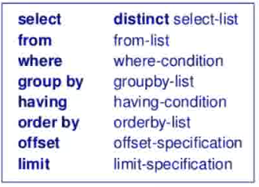

### Database Management Systems (DBMS)
* Data Independence
* Efficient Data access
* Data integrity & security
* Transaction Management
* Query language
* Database design
* Database programming
* **Data model**: used by DBMS, defined by user for querying the data
* **Schema**: Description of the data model
* **Schema instance**: Content of the DB at a specific time
* **Relational Model (RDBMS)**: Microsoft SQL, SAP, MySQL, SQLite
  * Data modeled using **relations** (i.e. tables)
  * Each relation defined by **relation schema**, and a relation is a set of tuples
    * Relation schema: (attributes, data constraints, domain constraints)
      * e.g. (id: int, name: text, birthDate: date)
      * Attribute: Column name
        * Must be a value in domain or null
      * Domain: datatype
      * Data constraints: e.g. non null, unique etc
        * (Data) Integrity Constraint: Specified with schema, ensure relation instance is *legal*
          * Domain constraints (datatype)
          * Key constraints
            * Non-null
            * **Superkey**: combination of attributes(columns) that uniquely identifies each tuple
            * **Key**: smallest combination of attributes that uniquely identifies each tuple
            * **Candidate Key**: possible keys
            * **Primary key** (PK): key chosen to uniquely ID each tuple
            * **Foreign key** (FK): attribute (or set of attributes) that refer to the PK of another relation
              * Must either refer to a valid PK or be set to NULL
              * FK constraints are known as **referential integrity constraints**
          * Foreign key constraints (FK must exist if set)
          * Other data constraints
    * Each row in a relation is a tuple/record has one component per attribute
    * A **relational database schema**: collection of relation schemas + data constraints
    * Relation (relation instance): A table populated with data
    * Relational database (database instance): collection of tables
* Object-relational model: Postgres

* Relational Algebra: Internals of SQL
  * Closure property: always outputs 1 table 
  * Operators:
    * Unary (1 input table)
      * Selection $\sigma_{condition}$ (select{c}(R)): Select rows that satisfy condition
        * condition is ur usual bool condition {(), =, <, $\leq$, <\> (neq), op, not, and, or}. "null" can be used.
        * anything + null = null. As a result, final result can be True, False, Unknown
      * Projection $\pi_{columns}(Table)$ (project{c}(R)): Select unique values from columns
      * Renaming $\rho_{col:new_name,...}(Table)$ (rename{lbls}(R)): Rename columns (e.g. need multiple instances of same data)
    * Binary (2 *union-compatible* input tables)
      * Union Compatible: Use schema of first table. Same # of columns, and columns have same domain order. Names don't have to be the same
      * Union (U,R|S) (in R or S, rm dupes), Intersect ($\cap$) (R & S), Set-difference (R-S) (in R but not S)
      * Cross Product (RxS, R*S): concat the columns of both tables, generate all pairwise permutations of tuples from each table
  * Methodologies:
    * 1. Draw a tree
    * 2. Sequence of steps (Each line stores the operation result as a new relation)
  * Joins (combinations of operators):
    * Inner join ($R\bowtie_{cond}S = \sigma_{cond}(R x S)$) (R~{c}S): Cross product, then select by condition
    * Natural join ($R\bowtie S$) (R~S): Cross product, then drop duplicate columns from S
      * Inner join on all columns with same name, rm duplicate cols
    * Outer joins: inner join, but also include dangling tuples (rows that failed condition). For these tuples, since unjoined, will have unknown data; fill those cols with null
      * R $\rightarrow_{cond} S$ (R~\>{c}S): include dangling tuples from R
      * R $\leftarrow_{cond} S$ (R<~{c}S): include dangling tuples from S
      * R $\leftarrow\rightarrow_{cond} S$ (R<~\>{c}S): include dangling tuples from R then S
      * If condition not included, it's natural outer join
* SQL: Structured Query Language (declarative)
  * domain-specific language (DSL)
  * Data Definition Language (schemas)
    * Constraints
      * Not-null, Unique, PK, FK, General
      * Column, Table, Assertions (not supposed for most DBMS, constraints enforced by triggers)
    * `CREATE TABLE table (col_name_by_newline, [constraints])`;
      * column entry: `colName datatype [PRIMARY KEY] [UNIQUE] [NOT NULL] [DEFAULT value] [REFERENCES y (colInY)] [CHECK (condition)],`
        * Primary key: automatically unique & not null
      * constraint entries: 
        * General format: `[CONSTRAINT name] unique/composite/fk [DEFERRABLE INITIALLY DEFERRED|IMMEDIATE ]`
        * Unique: `UNIQUE (col1, col2)`
        * Composite: `PRIMARY KEY (col1, col2, ...)`
        * Foreign Key: `FOREIGN KEY (colInX [, ...]) references y (colInY [, ...]) [MATCH FULL] [ON DELETE refAction] [ON UPDATE refAction]`
          * If FK is composite, partial nulls are allowed unless `MATCH FULL` is specified. 
        * Condition: `CHECK (column constraints e.g. 'day in (1,2,3))'`
        * Named constraint: add `CONSTRAINT name` in front of the constraint
        * refAction (for when new FK is invalid / is in use): `RESTRICT` (reject operation, not deferred) | CASCADE (changes from parent propagates) | SET NULL (set any FK references to null) | NO ACTION (same as restrict, deferrable) | SET DEFAULT (set any FK references to default value specified in schema)`
        * Deferred checking: only for `UNIQUE | PK | FK`
          * `INITIALLY DEFERRED`: Checks will only be conducted at end of transaction.
          * `INITIALLY IMMEDIATE`: Checks enforced per query, but you can call `SET CONSTRAINTS constraintName DEFERRED` to defer it
    * `DROP TABLE [IF EXISTS] x [CASCADE]`;
      * `CASCADE`: Drop objects that have foreign keys linked to table
    * Schema Modification
      * `ALTER TABLE table ALTER COLUMN columnName [DROP addOn (e.g. DEFAULT)]`
      * `ALTER TABLE table DROP COLUMN columnName`
      * `ALTER TABLE table ADD COLUMN (column entry)`
      * `ALTER TABLE table ADD CONSTRAINT (constraint entry)`
  * Data Manipulation Lanuage (queries)
    * `INSERT INTO table [(col1, col2...)] VALUES tuple1, tuple2...` * Subqueries can be used to automate stuff: `insert into Enrolls (sid, cid) select studentId, 101 from Students where year = 1;`

    * `DELETE FROM table [WHERE condition]`
    * `UPDATE table SET col = col + i [WHERE condition]`
  * `SELECT [distinct] {columns | *} FROM tableSelector [WHERE condition] [{UNION | INTERSECT | EXCEPT} [ALL] subquery] [ORDER BY orderby] [OFFSET trimTop] [LIMIT maxTuplesReturned]`
    * `columns`: `col1 [as newName], ...`
      * Operations between columns along the same tuple is allowed: e.g. `price * qty as cost`
    * `tableSelector`: 
      * Option 1: N tables e.g. `table1 as x, table2 as y`
      * Option 2: JOIN, default is inner e.g. `table1 X [NATURAL] [LEFT | RIGHT] [INNER | OUTER] JOIN table2 Y ON {condition e.g. (X.name < Y.name) and (X.attr = Y.attr)}`
        * Temporary tables can be created by wrapping the join with brackets e.g. `SELECT C.cname, S.pizza FROM Customers C left join (Restaurants R join Sells S on R.rname = S.rname) on C.area = R.area;`
    * `UNION, INTERSECT, EXCEPT`: removes duplicates unless the `ALL` keyword is included (e.g. when you want to count the # of occurences)
      * UNION = A U B, Intersect = A n B, Except = A - B
    * Subqueries:
      * `[NOT] EXISTS (SELECT ...)`: Subquery is a condition by itself; return T if subquery is not empty
      * The returned subquery must have the same # of columns as the operands in the condition
      * `(col1,..) IN (SELECT ...)`: T if value can be found in subq
      * `(col1,..) comparator ANY (SELECT ...)`: T if comparison is T for any in subq
        * Comparator: `=  >  <  >=  <=  <>  !=`
        * `SOME` is an alias for `ANY`
      * `(col1,..) comparator ALL (SELECT ...)`: T if comparison is T for all in subq
    * Orderby: `col1 asc|desc, col2 asc|desc` or `col1,col2 desc`. Default asc.
  * Transactions
    * Wrap a series of queries using `BEGIN;` and `COMMIT;`
    * Enforces **ACID**:
      * Atomicity: results of queries all shown or not
      * Consistency: Change in data will always abide all rules (constraints, cascades, triggers etc)
      * Isolation: Can be considered to be "serializable"; not affected by other reads & writes
      * Durability: Committed transaction will work even if system fails
    * Deferrable constraints: defer checks to the end of transaction
  * Datatypes
    * `boolean`, `smallint`, `integer`, `float8`, `numeric`, `numeric(max_n, decimal)`, `char(fixed_n)`, `varchar(n)`, `text`, `date`, `timestamp`
  * NULL
    * Same as relational: comparison & arithmetic with null = unknown result
  * Operations
    * `x IS NULL, x IS DISTINCT FROM y`
    * `||`: concat
    * `round()`
* Entity-Relationship (ER) Model
  * Diagram to show entities & relationships schema as diagram 
  * **Entity Set** (Table for Entity data): Rectangle w/ name
    * Entity: entry in table
    * **Weak Entity Set**: Double boxed rectangle w/ name
      * **Uses Partial Key:** Can only be identified by combining a attr with PK from **owner entity** through a relationship
      * Attached relationship is double diamonded, and the relationship doesn't exist in the schema as a table (it's just drawn for syntax)
      * Must have total participation (double line)
      * Weak Entity must have Many-to-One relationship to owner 
        * Cannot have many to many since it needs unique owner entity
        * Cannot one-to-one since otherwise just merge into 1 table
      * Existence dependent on owner entry
  * **Attribute**: Oval w/ name, attached to 1 table with 1 full line
    * Primary Key / Composite key: All Underlined
  * **Relationship set** (Table for relationship data): Diamond w/ name.
    * Many-to-many relationship
    * Relationship set: immediate neighborhood of relationship 
    * Relationship role: necessary if an entity has multiple edges to the same relationship.
    * Connected to 2 entities (rects): binary relationship set. 3 entities = ternary relationship set.
    * Primary key of this table includes primary keys of entities it is connected to (exceptions based on constraints)
      * These attributes are foreign keys; implied and omitted from diagram
      * Relationships can also have additional attributes, and some of it can be part of its PK.
  * **Relationship role**: label over the line. Added to FK attribute as prefix.
  * **Relationship constraints**: denoted by type of line between **Entity Set E1 to Relationship Set R to E2**
    * E to R represents its relationship with the other entity (e.g. E can only have 1 E2)
    * **Default**: E1 has (?, 0..N) relationship w/ E2
    * **Key Constraint: E1 has (?, *..1) relationship w/ E2**: Arrow from E1 to R
      * If R has any E that is 1 to N, it only needs E's PK as its PK. 
        * PKs from both entities will still be imported as FK, though.
        * If many Es with 1 to N, can choose any E
    * **Total Participation Constraint: E1 has (?, 1..*) relationship w/ E2**: Double line E1 to R
      * If just normal line, it's called partial participation constraint.
    * **E1 has (?, 1) relationship w/ E2**: Combine both (double line + arrowhead), exactly 1
    * **Line with boxhead from R1 to R2 (Aggregation)**
      * When you want to link an entity to a relationship (i.e. entity only cares about the other 2 entities if they are in love)
      * Foreign key of R1 is R2's PK (combined with PKs from other directly linked entities)
  * "Interfaces": The ISA ("is-a") pyramid
    * Subclasses attached to bottom of pyramid with single line only
    * Linked to a entity set (**superclass**) by *line* to top of the ISA pyramid. This *line* has significance:
    * **Single Line (Overlap: T, Covering: F)**: E belongs to (0..N) subclasses
    * **Arrow head (Overlap: F, Covering: F)**: E belongs to (0..1) subclasses
    * **Double Line (Overlap: T, Covering: T)**: E belongs to (1..N) subclasses
    * **Dbl Line + Arrow (Overlap: F, Covering: T)**: E belongs to (1..1) subclass
    * Subclasses are another table with their own attributes and use superclass' PK as FK
      * With added constraint `on delete cascade` (deletion in superclass propagated to subclass) to the FKs
  * **Diagram to Schema**
    * Option 1: Follow 
    * Option 2: Merge Relationship table w/ entity table on the 1-side if it's a 1 to M relationship
  * Guidelines
    * Capture as many application's constraints as possible without imposing unnecessary ones
* Aggregate Functions `fx(attribute|*|expression)`
  * `...WHERE j = (SELECT max(x) FROM y)`
  * `max(price * qty)` is also possible
  * Return null if table is empty / attrs are null: `min(), max(), avg(), sum()`
  * Return 0 if table is empty / attrs are null: `count(attr)`
  * Returns # of entries even if all null: `count(*)`
  * Need to be used in a subquery 
  * **GROUP BY** columns (order of columns don't matter)
    * 
    * `ORDER BY` can include aggregate functions after `GROUP BY`
    * After using `GROUP BY` you can only `SELECT`:
      * columns grouped by
      * aggregate data
      * CANNOT select columns that were not included in group, unless the column grouped by is the PK (thus every tuple is unique)
    * The same column conditions above apply to `HAVING` (aggregate condition)
  * **WHERE B4 GROUP BY**: Only entries selected by `WHERE` will be aggregated by `GROUP BY` and subsequently trimmed again by `HAVING`
    * 
* Common Table Expressions
  * `WITH alias1 AS (SELECT QUERY), alias2 AS (..), ...`. `alias` can then be used in subsequent queries e.g. `SELECT * FROM alias` 
* Views
  * `CREATE VIEW alias AS (SELECT QUERY)`. Creates a **permanent** virtual table that can only be removed by dropping it
  * When `CREATE table` is called, that creates a **logical schema** (which is supported by a **physical schema** that actually implements each table). This segregation is logical/physical data independence (application won't be affected by implementation changes)
  * Views are an **external schema** against the logical schema.
* Advanced SELECT
  * **CASE**: SQL's switch statement; convert column to category
    * e.g. `SELECT CASE WHEN x > 2 THEN 'A'; WHEN x > 1 THEN 'B'; ELSE 'C' END AS colAlias FROM y`
  * **COALESCE(col1,col2,col3...)**: Return first non-null value in the list of cols provided, otherwise returns NULL
  * **NULLIF**: Replace value with null in col when selecting `SELECT NULLIF(col, 'val') FROM y`
* Pattern Matching with `LIKE`:
  * `_`: character wildcard
  * `%`:  wildcard for 0..N characters
  * 