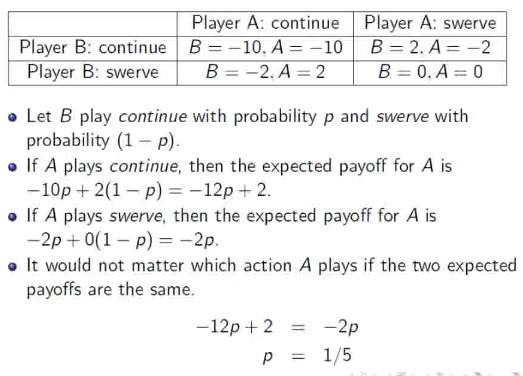
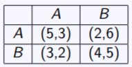
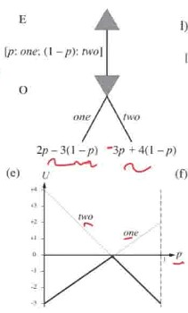

My notes for CS4246

Last Update: 2020

## Bellman Equation

* Apply concept of dynamic programming and optimal substructure to do **policy evaluation**

#### R(s):
$V(s) = R(s) + γ \max_{a ∈ A(s)}( \sum_{s'} P(s'|s,a)V(s'))$

* **Value of a state** = **its value** + (Exploration Factor) x **best value of next state**
  * How to get best value of next state?
    * By choosing best action: the action that maximizes expected next state value
      * Given (s, a), an action has the value of the sum of (value of next states) x (probability of reaching them).

|Var|Descript|
|-|-|
|s | Any possible state
|s' | Any possible next state from s
|a | Any possible action at s
|V(s) | Value of s
|R(s) | Reward of s (for staying on it)
|A(s) | All possible actions at state s
|γ | Exploration Factor
|P(s'\|s,a) | Probability of s' given (s, a)

### Bellman Equation Variants

#### R(s,a,s'):
$V(s) = \max_{a\in A} \sum_{s'\in S} T(s,a,s')[R(s,a,s') + \gamma V(s')]$

* Reward for transiting from s to s' via a
* Choose the action that has gives the highest (transition reward + discounted future value of that next state)

#### R(s,a):
$V(s) = \max_{a\in A}R(s,a) + \gamma \sum_{s'\in S} T(s,a,s')V(s')$

* Reward for taking action a at state s
* Choose the action that has gives the (highest reward + discounted value of all possible next states using said action)

### Converting between reward functions

#### R(s,a,s') -> R(s,a):
$R'(s,a) = \sum_{s'\in S}T(s,a,s')R(s,a,s')$

* The reward for taking an action is the sum of (all its possible transitions) x (related transition rewards)

#### R(s,a) -> R(s):
R'(post(s,a)) = \gamma^{-1/2}R(s,a)

* s' is abstracted out to "post(s,a)", which refers to the "post-state" for every (s,a). In this R:
```
// (s,a) always goes to post(s,a)
T'(s,a,post(s,a)) = 1
// The probability is factored in here
T'(post(s,a),b,s') = T(s,a,s')
// The states themselves don't have rewards
R'(s) = 0
// The reward for taking the action is put into the pseudo "post-state"
R'(post(s,a)) = gamma^(-1/2)R(s,a)
gamma' = gamma^(1/2)
```

## Value Iteration Algorithm

* Repeatedly update the Utility function U(s) with [bellman update].

$U_{t+1}(s) = R(s) + \gamma \max_{a\in A(s)} \sum_{s'} P(s'|s,a)U_t(s')$
* U is only updated after every single state has been looped through.

```
// Returns Utility function U(s)
function Value-Iteration(mdp, err_threshold)
    loop:
        U_t = U_t+1, max_delta = 0
        for all states s in S:
            Update U_t+1 with bellman equation.
            Update max_delta if abs(U(s) - U_t+1(s)) exceed max_delta
        break loop if max_delta less than err_threshold(1-gamma)/gamma 
    return U_t
```

## Policy Evaluation Algorithm
* Same as Value Iteration.
  * But we want to **evaluate a given policy pi_i**. Thus, **we don't need to take the max, we just need to use the policy.**
  * Hence: Instead of taking the best action, take the action based on the policy

$U_i(s) = R(s) + \gamma \sum_{s'} P(s'|s,\pi_i(s))U_i(s')$
    
## Policy Iteration Algorithm

* We don't need to calculate U(s) so accurately if we just want to find the optimal policy
* Two step approach:
1. **Init**: Start with initial policy pi_0
1. **Policy Evaluation**: Calculate Utility function U_i given current policy. See Policy Evaluation above.
2. **Policy Improvement**: Calculate new policy pi_i+1 using U_i.
3. **Termination**: Repeat until the new and old policy are the same (no change).

```
// Returns policy pi
function Policy-Iteration(mdp)
    U = set all to 0
    pi = random policy
    loop
        unchanged = true
        U_i = Policy-Evaluation(pi, U, mdp)
        for all states s in S:
            If the best action at s is different from pi[s]:
                Update pi[s]
                unchanged = false
        break if unchanged
    return pi
    
```
The check for the best action is done as follows:

$\max_{a\in A(s)} \sum_{s'} P(s'|s,a)U_i(s') > \sum_{s'} P(s'|s,\pi_i(s))U_i(s')$

* Identify the action with highest utility at s
* Check if it is the same action taken in the policy

## Modified Policy Iteration
* Only do k iterations (i.e. up to a horizon) instead of until no change

## Types of tasks in RL
* Prediction: Given a policy, measure how well it performs.
* Control: Policy not fixed, find optimal policy.
* See this [StackExchange post](https://stats.stackexchange.com/questions/340462/what-is-predicted-and-controlled-in-reinforcement-learning)

## Model-Based Prediction
* Prediction: Given traces of a policy and the final reward, learn the utility function (based on policy) by constructing the model from the data using an agent:
  * Learn **transition model** and **reward function** using an **Adaptive Dynamic Programming** (ADP) agent.
  * **Calculate the Utility function.**

```

// persistent variables
s_prev
pi: policy
mdp: current constructed model, rewards and discount
U: table of utilities
Nsa: Table keeping count of number of times at state s, action a was taken
Nsas': Table keeping count of number of times the next state was s' given (s,a) (thus s,a,s')

// Called everytime a new percept is observed by the agent
// Percept: (previous state s, current state s', current reward r')
function PASSIVE-ADP-AGENT(percept)
    // Initialize U[s] and R[s] with its observed reward
    if s_curr is new:
        U[s_curr] = r_curr
        R[s_curr] = r_curr

    // If the state was arrived from a transition, update the transition function
    if s_prev not null:
        // Increment # of times event happened
        Nsa[s_prev,a]++
        Ns'sa[s_curr,s_prev,a]++
        
        // Update transition function for every known reachable state by (s,a)
        for every state where Ns'sa[state,s,a] > 0:
            // Update probability of transition
            T(s,a,s') = Ns'as[s,a,s'] / Nsa[s,a]

    // Update U based on new transition function
    U = Policy-Evaluation(pi, U, mdp)

    // If the policy is terminal, then don't recommend new actions
    if s_curr is terminal:  s_prev,a = null
    else:                   s_prev,a = s_curr, pi[s_curr]
    return a
```


## Model-Based Control
* Learn the policy, not the utility
* Just replace Policy-Evaluation with Policy-Iteration
* The policy no longer stays fixed but changes as transitions and rewards learnt
* Note that however the algorithm is greedy and may not return the optimal value

## $\epsilon$-greedy
* Hence must do e-greedy exploration (choose a greedy action with 1-e probability and random action with e probability)
  * Greedy in the Limit of Infinite Exploration (GLIE), e = 1/t
  * Start with a high epsilon, then slowly reduce the number of random actions you take (by reducing the value of e) with every policy iteration as you become more and more certain you have an optimal algorithm

## Monte Carlo Learning

* Monte Carlo Learning (Direct Utility Estimation)
  * Given a series of states as a "trial" e.g. this is a trial: (1)-.04->(2)-.04->(2)-.04->(3)-.04->(4)-.04...->(5)+1
  * Keep a running reward average for every state; after infinite trials, sample average will converge to expected value
    * e.g. for the above trial, maybe state (1) has a sample total reward of 0.72
      * Calculate by taking sum of rewards from that state to the end)
    * If a state is visited multiple times in a trial e.g. state (2):
      * first-visit: take the sum of rewards from only on the first visit per trial 
      * every visit: take multiple sums for every time the state was visited in a trial.

Assume state s encountered k times with k returns, and each summed reward is stored in G_i(s). 

* Note that G_i(s), given infinitely many i iterations, will converge to the true value; hence G_i(s) - U_k-1(s) is the MC error, or prediction error

$U_k(s) = \frac{1}{k}\sum_{i=1}^{k}G_i(s)$

$= \frac{1}{k}G_k(s) + \frac{1}{k}\sum_{i=1}^{k-1}G_i(s)$

$= \frac{1}{k}G_k(s) + \frac{1}{k}*(k-1)U_{k-1}(s)$

$= \frac{k}{k}U_{k-1}(s) - \frac{1}{k}U_{k-1}(s) + \frac{1}{k}G_k(s)$

$U_k(s) = U_{k-1}(s) + \frac{1}{k}(G_k(s) - U_{k-1}(s))$

* The difference between the current U_k(s) and the previous U(s) is the prediction error (if you want to mnimize absolute loss, you can use median instead of average)
* Note that U(s) here can also apply to U(s,a), and can also be renamed as Q(s) and Q(s,a)

```
# Calculating "value sum": Sum the values from s to the end in the trial

# Monte Carlo Prediction (Learning U(s))
After every trial:
    Take every state (or first state occurence) and calculate its value sum 
    Increment Ns
    # Update U(s) after every trial
    U_k(s) = U_k-1(s) + 1/k(sum - U_k-1(s))
    
# Monte Carlo Control (Learning pi)
After every trial:
    Take every (s,a):
        newR(s,a) = take every/1st (s,a) and calculate its value sum
        Increment Ns
        # Update Q(s) after every trial
        Q(s,a) = Q_k-1(s,a) + 1/k(newR(s,a) - Q_k-1(s,a))
    For every s:
        pi(s) = Take action that maximizes Q(s,a)
```

Advantages
* Simple
* Unbiased estimate

Disadvantages
* Must wait until a full trial is done in order to perform learning
* High variance (reward is the sum of many rewards along the trial), so need many trials to get it right

## Temporal Difference Learning
* i.e. TD(0)
* Very similar to Monte Carlo Learning
* Replace the prediction error with the temporal difference error

$U^\pi(s) = U^\pi(s) + \alpha(R(s) + \gamma U^\pi(s') - U^\pi(s))$

* Transition from state s to s'.
* Alpha is the learning rate.
  * Converges if alpha decreases with the number of times the state has been visited (think GLIE)
* $R(s) + \gamma U^\pi(s')$: **Temporal Difference target**
  * Reward of current state + Expected utility from the new state s'
  * If there is no error, this should be equal to the current utility $U^\pi(s)$
  * this is basically bellman update, policy evaluation

* $R(s) + \gamma U^\pi(s') - U^\pi(s)$: **Temporal Difference error**
  * (amount of utility change from previous state s to current state s')
  * difference between the estimated reward at any given state or time step and the actual reward received
  * Reward of current state + discounted future reward(future state) - expectedRewardWithIncludesFutureRewards(s)

```
## Prediction
TD-Agent:
for every percept (curr_state s', immediate reward r')
if s' is new:
    U[s'] = r'
if s not null:
    Ns[s]++
    # Note that alpha is a function that takes in Ns[s]
    # It steadily decreases over # of iterations
    U[s] = U[s] + alpha(Ns[s])*(r+gamma*U[s']-U[s])
if s' terminal:
    s,a,r = null
#else: # update prev data
    s,a,r = s',pi[s'],r'
return a
```

Advantages

* Can learn with every step (in a trial)
* Usually converges faster in practice


Disadvantages
* Online; lower variance, but estimate on how good your estimate is; biased
* Assumes MDP
* Error can go in any direction

### SARSA
SARSA uses TD learning w.r.t. a specific policy:

$U^\pi(s,a) = U^\pi(s,a) + \alpha(R(s,a) + \gamma U^\pi(s',\pi((s')) - U\pi(s,a))$

On-policy

### Q-Learning
Q-Learning uses TD learning w.r.t. the optimal policy (s' is the next state after (s,a) is taken):

$Q(s,a) = Q(s,a) + \alpha(R(s,a) + \gamma \max_{a\in A(s')} Q(s',a) - Q(s,a))$

Off-policy

## n-step TD
Alister Reis has written a very good [blog post](https://amreis.github.io/ml/reinf-learn/2017/11/02/reinforcement-learning-eligibility-traces.html) on this

* n-step: n is the # of steps you use in your temporal difference.
    * 1-step (or $G_t^{(1)}$): 
      * $R(s) + \gamma U^\pi(s')$: **Temporal Difference target**
      * $R(s) + \gamma U^\pi(s') - U^\pi(s)$: **Temporal Difference error**
    * 2-step (or $G_t^{(2)}$): 
      * $R(s) + \gamma R(s') + \gamma^2 U^\pi(s'')$: **Temporal Difference target**
      * $R(s) + \gamma R(s') + \gamma^2 U^\pi(s'') - U^\pi(s)$: **Temporal Difference error**
      * s: the state you stepped into, R(s) is the reward for that state, s' and s'' are s_t+1 and s_t+2 respectively in that trial
      * The reason why gamma stacks is because it is multiplicatively stacked with every iteration (think of it as "unpacking" U(s))
      * 3-step and beyond is just continued "unpacking"

## TD($\lambda$)
Alister Reis has written a very good [blog post](https://amreis.github.io/ml/reinf-learn/2017/11/02/reinforcement-learning-eligibility-traces.html) on this
* Basically you want to do n-step but you don't want to choose n
* i.e. instead of calculating n-step return $G_t^{(n)}$, you want to calculate $G_t^{(\infty)}$
* So you take a $\lambda \in [0,1]$ and use it to multiplicatively weight all the $G_t^{(n)}$
  * i.e. $\lambda^0 G_t^{(1)} + \lambda^1 G_t^{(2)} + ... + \lambda^{\infty-1} G_t^{(\infty)}$
  * If you remember your geom progression, $\sum_{n=0}^{\infty}\lambda^n = \frac{1}{1-\lambda}$
  * So to normalize all this to 1, we need to multiply it by $(1 - \lambda)$
* We get this cursed formula $G^\lambda_t = (1-\lambda)(\lambda^0 G_t^{(1)} + \lambda^1 G_t^{(2)} + ... + \lambda^{\infty-1} G_t^{(\infty)})$
* Which is equal to $G^\lambda_t = (1-\lambda)\sum_{n=0}^{\infty}\lambda^{n-1} G_t^{(n)}$
* Now you're probably wondering how to calculate this without calculating to the end
  * Because I know I was wondering about it since my prof didn't talk about it
* So that's why some geniuses used something called **eligibility trace $e$** which keeps track of how "fresh" each state is (based on frequency and last visit) ([img src](https://www.researchgate.net/figure/This-figure-shows-the-eligibility-trace-for-four-different-algorithms-Sarsal-1_fig1_221456594)).
  * Since it sums to infinity (or at least, sums to the end of the trial), They use this eligibility trace to iteratively calculate $G^\lambda_t$ with each timestep as opposed to calculating it all in 1 shot at the end


  * i.e. every state has an eligibility trace, init at 0
  * when state is visited at that timestep, its $e(s)$ adds 1
    * This is called an **accumulating eligibility trace**.
    * If just reset to 1, it's called a **replacing eligibility trace**.
  * at every timestep these values are multiplied by lambda and gamma (they "deteriorate")
* With this eligibility trace system, you no longer just update the U(s) of 1 state with every timestep, you run the update for *every* state, but the TD error is weighted by each state's own eligibility trace.
  * So for every timestep, update all eligibility traces:
    * `eligibility *= lamb * gamma`
    * `eligibility[state] += 1.0`
  * Then get the TD error for the current timestep: `td_error = reward + gamma * state_values[new_state] - state_values[state]`
  * Then finally update U(s) for all states: `state_values = state_values + alpha * td_error * eligibility` 
  * As per Alister

See also?
* https://towardsdatascience.com/reinforcement-learning-td-%CE%BB-introduction-686a5e4f4e60#:~:text=random%20walk%20example-,The%20Idea%20of%20TD(%CE%BB),0.5*Gt%3At%2B4

## On & Off Policy
* On-policy: 
  * One policy used for both generating data & training
  * e.g. SARSA
    * Converges to optimal policy if:
      *  [$\epsilon$-greedy](#epsilon-greedy)
* Off-policy: 
  * One *behavior* policy for generating training data
    * generating data: interacting with environment to get info
  * One *target* policy to be trained
    * Converges to optimal policy if: 
      * Decaying $\alpha$ 
      * Every transition is taken infinitely many times in behavior policy

## Function Approximation
<a name="vector-of-parameters"></a>
<a name="theta"></a>

* State space too large -> solve by approximating utility function
  * Approximate using a linear function of **features**
  1. Define a linear function to approximate U(s):
    * $\hat{U}_{\theta}(s)=\theta_{1} f_{1}(s)+\theta_{2} f_{2}(s)+\cdots+\theta_{n} f_{n}(s)$ 
      * e.g. $\hat{U}_{\theta}(x,y)=\theta_{0} + \theta_{1}x+\theta_{2} y$ 
      * s in this case is (x,y)
  2. And in this linear function you have a **vector of parameters** $\theta$ = $\{\theta_0,\theta_1,...\theta_n\}$
  * Goal is to learn $\theta$ 

### Supervised learning
* Method 1: learn using set of training samples
* Given a set of training samples beforehand
* Do least squares estimation to fit params
  * e.g. given linear function $\hat{U}_{\theta}(x,y)=\theta_{0} + \theta_{1}x+\theta_{2} y$ 
  * you have a set of samples $\{((x_1,y_1,u_1),(x_2,y_2,u_2),...,(x_n,y_n,u_n)\}$ where U is value of the linear function and x and y are the function input
  * you can do linear regression to solve

### Online learning
* Method 2: learn on the job
* Gradient descent using every piece of evidence
* $E_j(s) = (\hat{U}_{\theta}(s) - u_j(s))^2 /2$
  * Step in the gradient of this magic function with every new sample of $(input, outcome)$ weighted by the learning rate $\alpha$
  * Possible explanations of this function: [1](https://en.wikipedia.org/wiki/Stochastic_gradient_descent) [2](https://en.wikipedia.org/wiki/Proximal_gradient_method) [3](https://en.wikipedia.org/wiki/Proximal_operator)
* For every parameter $\theta_i$ in $\theta$:
  * $\theta_{i} \leftarrow \theta_{i}-\alpha \frac{\partial E_{j}(s)}{\partial \theta_{i}}$, which expands to:
  $$
  \theta_{i} \leftarrow \theta_{i}+\alpha\left[u_{j}(s)-\hat{U}_{\theta}(s)\right] \frac{\partial \hat{U}_{\theta}(s)}{\partial \theta_{i}}$$

* e.g. given linear function $\hat{U}_{\theta}(x,y)=\theta_{0} + \theta_{1}x+\theta_{2} y$ 
  * $\theta_{0} \leftarrow \theta_{0}+\alpha\left(u_{j}(s)-\hat{U}_{\theta}(s)\right)$
  * $\theta_{1} \leftarrow \theta_{1}+\alpha\left(u_{j}(s)-\hat{U}_{\theta}(s)\right) x$
  * $\theta_{2} \leftarrow \theta_{2}+\alpha\left(u_{j}(s)-\hat{U}_{\theta}(s)\right) y$

<details><summary>We can extend the param formula to temporal difference learning for TD:</summary><p>

  $$
  \theta_{i} \leftarrow \theta_{i}+\alpha\left[R(s)+\gamma \hat{U}_{\theta}\left(s^{\prime}\right)-\hat{U}_{\theta}(s)\right] \frac{\partial \hat{U}_{\theta}(s)}{\partial \theta_{i}}
  $$

</p></details>

<details><summary>As well as Q-learning:</summary><p>

  $$
  \theta_{i} \leftarrow \theta_{i}+\alpha\left[R(s)+\gamma \max _{a^{\prime}} \hat{Q}_{\theta}\left(s^{\prime}, a^{\prime}\right)-\hat{Q}_{\theta}(s, a)\right] \frac{\partial \hat{Q}_{\theta}(s, a)}{\partial \theta_{i}}
  $$

  These are called semi-gradient methods because target is not true value but also depends on θ.

</p></details>

### Sources of instability
* Instability and divergence tend to arise when the following three elements are combined:
  * [Function approximation](#Function-Approximation)
  * Bootstrapping
    * Use current estimates as targets, e.g. [TD](#temporal-difference-learning)
    * Rather than complete returns, e.g. [MC](#monte-carlo-learning)
  * [Off-policy training](#On-&-Off-Policy)
    * Training on transitions other than that produced by the target policy.

### Deep Q-learning
* Online Q-learning with non-linear function approximators is unstable
* DQN uses experience replay with fixed Q-targets:
  * Makes input less correlated, reduce instability
* Procedure:
1. Take action $a_t$ using [ϵ-greedy](#epsilon-greedy)
2. Store the observed transition $(s_t,a_t,r_{t+1},s_{t+1})$ in a round-robin buffer
3. When there are enough transitions:
  1. Sample random mini-batch of transitions from buffer
  2. Set targets to $r+\gamma \max_{a'}Q(s'a',\theta^{-})$
  3. Gradient step on mini-batch squared loss w.r.t. $\theta$
  4. Set $\theta^{-}$ to $\theta$ every C steps
  5. Get more transitions & repeat
  6. Haha if you didn't get that don't worry I don't think I'd get it if I didn't use Google gdi fucking useless slides
* [Video](https://deepmind.com/research/publications/human-level-control-through-deep-reinforcement-learning)

### Policy Search
<a name="next-state-softmax"></a>
<a name="policy-grad-vector"></a>

* Often use the Q-function parameterized by $\theta$ to represent the policy:
  * $\pi(s)=\arg \max _{a} \hat{Q}_{\theta}(a, s)$
* Adjust $\theta$ to improve policy
* However, the max operator makes gradient based search difficult.
* Thus, represent **the next state as a vector of probabilities at state s, given action a** (i.e. $\pi_{\theta}(s,a)$) using softmax: 
  * $\pi_{\theta}(s, a)=e^{\hat{Q}_{\theta}(s, a)} / \sum_{a^{\prime}} e^{\hat{Q}_{\theta}\left(s, a^{\prime}\right)}$
* With this vector of probabilities we want to maximize of $U(\theta)$ w.r.t $\theta$. 
  * We can do this by differentiating $U(\theta)$ w.r.t. $\theta$, then taking a gradient ascent in that direction.
  * This "direction" is the **policy gradient vector** represented as $\nabla_{\theta} U(\theta)$


#### [TD(0)](#temporal-difference-learning) example where only 1 step is taken:
  * You're at state $s_0$ and $\pi_{\theta}\left(s_{0}, a\right)$ returns vector of action probabilities
  * Recall $V(s_1)$ = reward of action x action probability
  * Thus [policy gradient vector](#policy-grad-vector) $\nabla_{\theta} V(s;\theta)=\nabla_{\theta}E[V(s';\theta)]$
    * $=\nabla_{\theta} \sum_{a} \pi_{\theta}\left(s_{0}, a\right) R(a)$ 
    * $=\sum_{a}\left(\nabla_{\theta} \pi_{\theta}(s, a)\right) R(a)$
    * $\begin{aligned} =\sum_{a} \pi_{\theta}\left(s_{0}, a\right) \frac{\left(\nabla_{\theta} \pi_{\theta}(s, a)\right) R(a)}{\pi_{\theta}\left(s_{\theta}, a\right)} \\ \approx \frac{1}{N} \sum_{i=1}^{N} \frac{\left(\nabla_{\theta} \pi_{\theta}\left(s_{0}, a_{i}\right)\right) R\left(a_{i}\right)}{\pi_{\theta}\left(s_{0}, a_{i}\right)} \end{aligned}$
      * N: # of trials/episodes
        * Approximation using samples generated from [$\pi_\theta(s_0,a)$](#next-state-softmax)

#### If considering more steps, calculating the policy gradient becomes:
  * $\nabla_{\theta} U(\theta)=\nabla_{\theta} \sum_{\tau} P_{\pi_\theta}(\tau) G(\tau)$
    * $\tau$: Trajectory generated by policy
    * $P_{\pi_\theta}(\tau)$: Probability policy generates $\tau$
    * $G(\tau)$: sum of rewards from trajectory $\tau$
  * Using the policy gradient theorem, this can be written as:
  * $\nabla_{\theta} U(\theta) \propto \sum_{s} P_{\pi_{\theta}}(s) \sum_{a} \nabla_{\theta} \pi_{\theta}(s, a) Q_{\pi_{\theta}}(s, a)$
    * $P_{\pi_\theta}(s)$ is probability of being in state s (at any point in time) given initial state and $\pi$
      * formal: $P_{\pi_\theta}(s)$ = $\lim_{t\rightarrow oo} Pr\{S_t = s | s_0,\pi\}$ is the stationary distribution of states under $\pi$ (Sutton)

<details><summary> Proof of Policy gradient theorem: </summary><p>

* Computing the gradient of the value of the policy $\pi$ at state s:
  * We can expand the equation using product rule of calculus
  * $\begin{aligned} \nabla U_{\pi}(s) &=\nabla\left[\sum_{a} \pi(a \mid s) Q_{\pi}(s, a)\right] \\ &=\sum_{a}\left[\nabla \pi(a \mid s) Q_{\pi}(s, a)+\pi(a \mid s) \nabla Q_{\pi}(s, a)\right] \end{aligned}$
  * $=\sum_{a}\left[\nabla \pi(a \mid s) Q_{\pi}(s, a)+\pi(a \mid s) \nabla \sum_{s^{\prime}, r} p\left(s^{\prime}, r \mid, a\right)\left(r+U_{\pi}\left(s^{\prime}\right)\right)\right]$
  * $=\sum_{a}\left[\nabla \pi(a \mid s) Q_{\pi}(s, a)+\pi(a \mid s) \sum_{s^{\prime}} p\left(s^{\prime} \mid s, a\right) \nabla U_{\pi}\left(s^{\prime}\right)\right]$
  * If we unroll the last term, we get this eqn:
  * $\nabla U_{\pi}(s)=\sum_{a} \left[\nabla \pi(a \mid s) Q_{\pi}(s, a)+\pi(a \mid s) \sum_{s^{\prime}} p\left(s^{\prime} \mid s, a\right)\right.$
    * $\left.\sum_{a^{\prime}}\left[\nabla \pi\left(a^{\prime} \mid s^{\prime}\right) Q_{\pi}\left(s^{\prime}, a^{\prime}\right)+\pi(a \mid s) \sum_{s^{\prime \prime}} p\left(s^{\prime \prime} \mid s^{\prime}, a^{\prime}\right) \nabla U_{\pi}\left(s^{\prime \prime}\right)\right]\right]$
  * After repeated unrolling, where $P(s\rightarrow x,k,\pi)$ is the probability of transitioning from state s to state x in k steps under $\pi$, we get this general eqn:
  * $= \sum_{x \in S} \sum_{k=0}^{\infty} P(s \rightarrow x, k, \pi) \sum_{a} \nabla \pi(a \mid x) Q_{\pi}(x, a)$
  * Taking expectation over the initial state distribution (?) we get
  * $\nabla_{\theta} U(\theta) \propto \sum_{s} p_{\pi_{\theta}}(s) \sum_{a} \nabla_{\theta} \pi_{\theta}(s, a) Q_{\pi_{\theta}}(s, a)$

</p></details>

### REINFORCE algorithm
  * Monte Carlo approximation of the advantage function (?)
  * Continuing on, we can approximate the policy gradient using
  * $\begin{aligned} \nabla_{\theta} U(\theta) & \propto \sum_{s} p_{\pi_{\theta}}(s) \sum_{a} \frac{\pi_{\theta}(s, a) \nabla_{\theta} \pi_{\theta}(s, a) Q_{\pi_{\theta}}(s, a)}{\pi_{\theta}(s, a)} \\ & \approx \frac{1}{N} \sum_{i=1}^{N} \sum_{j=1}^{n_{i}} \frac{\nabla_{\theta} \pi_{\theta}\left(s_{i j}, a_{i j}\right) G_{i}\left(s_{i j}\right)}{\pi_{\theta}\left(s_{i j}, a_{i j}\right)} \end{aligned}$
    * N: # of all possible actions, producer of i
    * $n_i$: # of steps for the i-th trial
    * $a_{ij}$: action executed at state $s_{ij}$ on j-th step of the i-th trial
    * $G_i(s_{ij})$: Total reward received from the j-th step onward on the i-th trial
    * [$\pi_\theta(s,a)$](#next-state-softmax): Next state in softmax form
    * $\nabla_\theta \pi_\theta(s,a)$: Derivative of softmax form w.r.t. theta
  * Thus at each step j, we can update the params $\theta$ by taking its prev value + (learning rate) x (reward at step) x (rate of change of [$\pi_\theta(s,a)$](#next-state-softmax) w.r.t. $\theta$) / ([$\pi_\theta(s,a)$](#next-state-softmax)))
  * $\theta_{j+1}=\theta_{j}+\alpha G_{j} \frac{\nabla_{\theta} \pi_{\theta}\left(s, a_{j}\right)}{\pi_{\theta}\left(s, a_{j}\right)}$
    * $\alpha$: learning rate
    * $G_j$: reward at step j
    * [Differentiating](math#differentiate-by-vector) the next state softmax vector [$\pi_\theta(s,a)$](#next-state-softmax) w.r.t. the [parameters](#vector-of-parameters) 
  * We can use the dy/dx(ln(x)) identity to simplify it, thus obtaining the **REINFORCE algorithm**
  * $\theta_{j+1}=\theta_{j}+\alpha G_{j} \nabla_{\theta} \ln \pi_{\theta}\left(s, a_{j}\right)$

### Baseline
* In practice we can reduce the variance using any function $B(s)$.
* Recall that for the REINFORCE algorithm we are estimating
$$
\nabla_{\theta} U(\theta)=\sum_{s} p_{\pi_{\theta}}(s) \sum_{a} \nabla_{\theta} \pi_{\theta}\left(s, a_{j}\right) Q_{\pi_{\theta}}(s, a)
$$
- We can replace $Q_{\pi_{\theta}}(s, a)$ with $Q_{\pi_{\theta}}(s, a) - B(s)$, where $B(s)$ is any function and it stays the same. That replaceable portion is called the **Advantage function**.
$$
\sum_{s} p_{\pi_{\theta}}(s) \sum_{a} \nabla_{\theta} \pi_{\theta}\left(s, a_{j}\right)\left(Q_{\pi_{\theta}}(s, a)-B(s)\right)
$$

- It stays the same because $\pi_{\theta}\left(s, a_{j}\right)$ sums to 1 (since it's a vector of action probabilities). Since the derivative of a constant is 0, $B(s)$ doesn't have any actual effect.
$$
\sum_{a} \nabla_{\theta} \pi_{\theta}\left(s, a_{j}\right) B(s)=B(s) \nabla_{\theta} \sum_{a} \pi_{\theta}\left(s, a_{j}\right)=B(s) \nabla_{\theta} 1=0
$$

### Modifying the Advantage function
* **Monte Carlo estimate**: Set $B(s) = V_{\pi_\theta}(s)$
* **TD(0) variant**: Set $B(s) = V_{\pi_\theta}(s)$ and replace $Q_{\pi_\theta}(s,a) = E[r+\gamma V_{\pi_\theta}(s')]$
  * Thus, **TD(0) variant**: $A_{\pi_\theta}(s,a) = E[r+\gamma V_{\pi_\theta}(s')] - V_{\pi_\theta}(s)$
  * The parameter update function would then become:
  * $\theta_{j+1}=\theta_{j}+\alpha \nabla_{\theta} \ln \pi_{\theta}\left(s_{j}, a_{j}\right)\left(r_{j}+\gamma V\left(s_{j+1}, w\right)-V\left(s_{j}, w\right)\right)$
    * (?) I don't know how to derive this eqn lmao I only assume the advantage function or TD error is multiplicatively applied here
  * We can extend this to n-step TD or TD($\lambda$) by replacing $Q_{\pi_\theta}(s,a)$.
  * We can also use a value function estimator $V(s;w)$ with param $w$ to estimate the value. This would be called the actor-critic method, because:
    * you're learning a policy (actor) managed by the $\theta$ params
    * you're also learning a value function managed by $w$ params used only for evaluation (critic)

Reference:
https://papers.nips.cc/paper/1713-policy-gradient-methods-for-reinforcement-learning-with-function-approximation.pdf

## Partially Observable MDP
<a name="POMDP"></a>

* Are you seeing a trend?
* Function estimation: action replaced with probability vector [$\pi_\theta(s,a)$](#next-state-softmax)
* POMDP: So you're uncertain about current state?
  * No problem, just replace state with probability vector **belief** = $\{P_{s_0},...,P_{s_n}\}$
    * $b(s) = P(s=s_{current})$ 
  * **Filtering**: Tracking $b(s)$

### Updating The Belief
<a name="UTB"></a>

* This is defined as $b' = Forward(b,a,e)$:
  * b: belief, a: action, e: evidence
  * Next belief based on evidence observed given (b,a)
* $b^{\prime}\left(s^{\prime}\right)=C P\left(e \mid s^{\prime}\right) \sum_{s} P\left(s^{\prime} \mid s, a\right) b(s)$
  * C: normalizing constant to make belief sum to 1
  * $P(e|s')$: Probability of receiving evidence $e$ upon entering $s'$
  * Given bae, $b'(s')$ = (Pr. of seeing e at s') x (Pr. of action a bringing you to s' based on your previous states' likelihood)
* If small state space, just need to use optimal policy to map belief to action.

### Reward Function of Belief
<a name="RFB"></a>

* Expected reward of a belief: sum of R(s) x every probability
* $U(B) = \sum_s b(s) R(s)$
* This is equivalent to a dot product of b(s) and R(s)
* $U(B) = b(s) \cdot R(s)$
* Extending this concept to the *utility* of a belief given a fixed *conditional plan* p from *state* s (i.e. $\alpha_p(s)$)
  * Optimal policy: choose action offering best utility
  * Conditional plan: Think of it as if/elifs to return an action based on belief probabilities
  
* Given an optimal policy, the **Value function of a belief** is the best action given said conditional plan and belief:
* $V(b) = \max_p b \cdot \alpha_p$
* With |A| actions and |E| observations, there are $|A|^{O(|E|)^{d-1}}$ distinct depth-d plans

* However if we want to calculate the **value function of a conditional plan**:
* $\alpha_{p}(s)=R(s)+\gamma\left(\sum_{s^{\prime}} P\left(s^{\prime} \mid s, a\right) \sum_{e} P\left(e \mid s^{\prime}\right) \alpha_{p . e}\left(s^{\prime}\right)\right)$
* if you don't understand don't worry I don't either so I'll simplify based on other info
* The value of action, assuming the current state is s, = (reward of the current state) + discount x (expected value of the next state)
  * Expected value of next state has so many factors now:
    * Probability of transitioning to that state x 
    * Actual expected value of that state x
    * Probability that you are actually at that state given the evidence you receive upon entering said state
* $\alpha_{action}(s)=R(s)+\gamma\left(\sum_{s^{\prime}} P\left(s^{\prime} \mid s, a\right) \sum_{e} P\left(e \mid s^{\prime}\right) \alpha_{p . e}\left(s^{\prime}\right)\right)$
* You basically want to choose how far you want to look ahead (your depth / # of steps) 
* Then, calculate $\alpha_{action}(s)$ for every possible (s, action) pair, looking up to the chosen depth
* Then, you can plot the hyperplanes (see below) s.t. given the probability of being in a state, when should I do which action s.t. I maximize my overall value

### n step/depth plan
<a name="nsp"></a>

* Example: Simple boolean state world.
  * R(0) = 0, R(1) = 1
  * Actions: Stay Pr(0.9), Go Pr(0.9).
  * Discount factor γ = 0.9
  * Sensor reports correct state with prob 0.6.
  * Agent should prefer state 1

Calculating the value function vectors:

**0 step/depth plan** literally don't do anything because 0 steps lmao got'em
* $(α_{init}(0), α_{init}(1)) = (R(0), R(1)) = (0, 1)$

**1 step/depth plan:**
* Value = Current state + next state
* $\begin{aligned} \alpha_{[\text {Stay}]}(0) &=R(0)+\gamma(0.9 R(0)+0.1 R(1))=0.1 \\ \alpha_{[\text {Stay}]}(1) &=R(1)+\gamma(0.9 R(1)+0.1 R(0))=1.9 \\ \alpha_{[\text {Go}]}(0) &=R(0)+\gamma(0.9 R(1)+0.1 R(0))=0.9 \\ \alpha_{[\text {Go}]}(1) &=R(1)+\gamma(0.9 R(0)+0.1 R(1))=1.1 \end{aligned}$
* Using this we can plot the hyperplanes (lines for probability)
* Then we always choose the highest line at any point (thus maximizing utility)


**n step/depth plans**
* The more steps you look ahead, the more refined U(b) becomes
  * U(b) is convex
  * Some hyperplanes are dominated (i.e. never max) so can ignore them


### POMDP Value Iteration
<a name="POMDPVI"></a>

* Just keep calculating plans, removing useless plans
* If no change after awhile then return U
* PSPACE-hard problem lmao
* Variant: [SARSOP](http://bigbird.comp.nus.edu.sg/pmwiki/farm/appl/) 


## Game Theory / Multi-agent

### Single-move game
* 2 player games chosen for simplicity
* **Strategic / Normal form**: Payoff matrix:

* 2 players have their own utility based on their actions and the action of the other player
* **Strategy**: Policy
  * **Pure** strat: deterministic
  * **Mixed** strat: stochastic
  * **Strictly dominated**: strategy s is always better than s' regardless of whatever strategies other players have 
  * **Weakly dominated**: strategy s is sometimes better than s'
* **Strategy Profile**: Each player assigned a policy
  * Can be used to compute game's outcome 
* A **solution** is a strat profile where all strats are rational (i.e. maximize their E[U])
  * Iteratively remove dominated strategies (e.g. prisoner's dilemma, will always be better if testifying)
  * How to evaluate a solution?
  * out1 **Pareto optimal**: All players prefer outcome out1
  * out1 **Pareto dominates** out2: All players prefer outcome out1

### Equilibriums
* **Dominant Strategy Equilibrium**: Each player have their dominant (best) strategy
   **Nash Equilibrium** (local optimum): all all players can't get better outcomes from changing from their assigned strategies
    * Test by fixing all policies except the player's policy
    * Local optimum if a strategy involved is weakly dominated

### Prisoner's dilemma example

  * Rational choice for both: testify
  * (testify, testify) Pareto dominated by (refuse, refuse)
  * hence dilemma

### Finding Pure Strategy Nash Equilibrium
* Find optimal outcome for each action by either player
  * max(rows) for left player, max(cols) for top player
* If both players agree on their optimal outcomes, that is a **Pure Strategy Nash Equilibrium**

### Finding Mixed Strategy Nash Equilibrium
* Doesn't always work
* Assign probabilities to what *the other player* would do, then calculate expected returns with unknown variable
* Using the 2 equations, solve variable s.t. you are happy no matter what action you take (**indifferent**)
* This is the probability this *other player* should adopt as their mixed policy
* Repeat for the other player to get the mixture


* e.g. as player A, assume B continue with Pr. p, swerve with Pr. (1-p)

### Finding 2 player 0-sum game solution
* Sum of outcome (payoff) is 0
* One player always positive outcome, the other player always negative outcome
* Both players want to maximize / minimize
* **Minimax strategy** gives a Nash Equilibrium
  * https://staff.ul.ie/burkem/Teaching/gametheory2.pdf
    * Page 3
    * Player 1 assumes Player 2 knows their strategy & will minimize their profit
    * Expected reward of Player 1:
      * p = probability of player taking left action
      * q = probability of player taking left action
      * 
      * R1(p, q) = (p)(5q+2(1−q)) + (1-p)(3q+4(1−q))
      * Find $\frac{\delta R_1(p,q)}{\delta q}$ i.e. rate of change of reward w.r.t. enemy policy.
        * We want this to be 0 i.e. Player 1's strategy doesn't depend on Player 2's strategy.
        * Differentiate eqn. and get player probabilities & expected reward
        * If it's 0-sum, both players will reach the same probability value
    * Partial Derivatives:
      * $\frac{\partial f(x,y)}{\partial r}=\frac{\partial f(x,y)}{\partial x} \cdot \frac{\partial x}{\partial r}+\frac{\partial f(x,y)}{\partial y} \cdot \frac{\partial y}{\partial r}$


* Given these expected outcomes w.r.t. p, choose p s.t. you maximize the minimum 