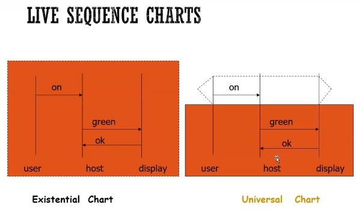
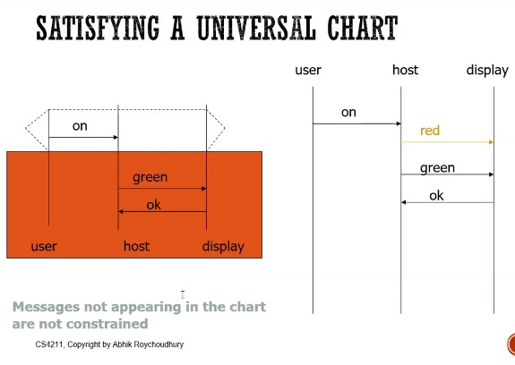
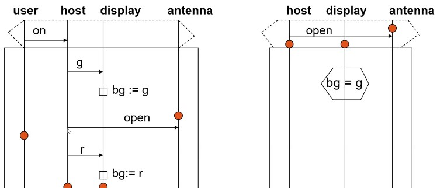
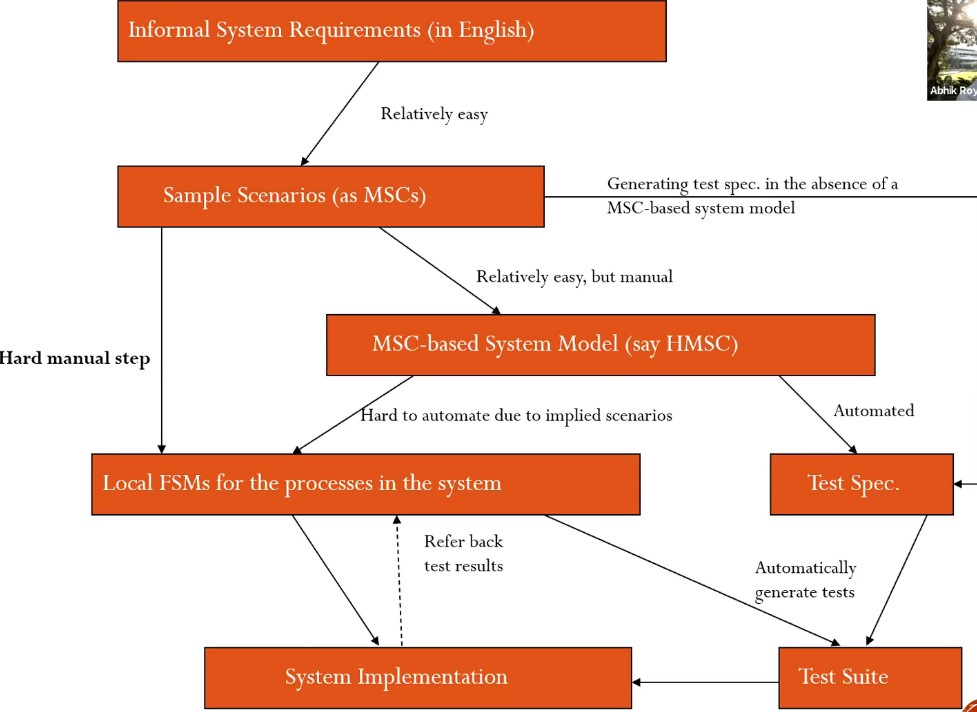

## DARWIN approach
* For regression testing
  * Given an old test input t that used to succeed but now fails
  1. Set of inputs that once fulfilled the same path condition is now split
  2. Compute the first path condition f
    * Path condition refers to all the "ANDs" in the conditions the path takes
  3. Compute the 2nd path condition f'
  4. Solve for $f \wedge \neg f'$ (followed by old program but not followed by new program)
     1. If I say "not of this path" or neg f' then I can consider all the paths that deviate from f' (take another path at at any branch)
     2. e.g. highlighting potential problem paths
        1. f = con1
        2. f' = con1 n con4 n con5
        3. f n -f' = iterate through all possibilities
           1. con1 n -con1 (not satisfiable)
           2. con1 n -con4 (satisfiable, check this branch)
           3. ...etc
  5. Create a new input that fulfils the path condition for $f \wedge \neg f'$
  6. Compare the path followed at step 5 and the path taken by the buggy program to get diagnostics

## Cause Clue Clauses
* Convert entire failing test trace into a SAT problem
  * Since it's failing, it's unsatisfiable
  * Use MAXSAT solver to find the smallest set of constraints that can be removed to make it satisfiable
    * Also specify some hard constraints: constraints that cannot be removed 
    * In doing so, find the error causing the SAT to fail

## Error Invariants
* What must always be unsatisified (i.e. never clause)

## Programs
1. I am interested in seeing how formal verification can be applied to practical use. Of course I can write my own model in promela, then specify my rules and then model check based on that. But I am curious: is there a way to automatically generate a model from my code?
  * Are there tools in place that will automatically perform the tasks described in class?
  * What are the tools I can use to formally verify a model?
    * Promela:
      * [SPIN, obviously](https://github.com/nimble-code/Spin)
  * Given a program in a given language:
    * What are the tools I can use to automatically generate a model (of my program)?
      * Text
        * [FSMGenerator](http://fsmgenerator.sourceforge.net/)
          * Last Updated: 2008
        * 
    * What are the tools I can use to automatically generate test cases for it?
      * http://www.cs.ru.nl/~lf/publications/BFS05.pdf
      * C
        * [CBMC](https://www.cprover.org/cbmc/)
          * Properties verified using assertions. See [here](http://www.cprover.org/cprover-manual/properties/)
          * CMBC can also be used to convert a C program into a SAT formula. See https://cs.stackexchange.com/questions/99685/is-there-a-way-to-convert-a-program-into-a-boolean-formula
      * Java
        * [JBMC](http://www.cprover.org/jbmc/), [GitHub](https://github.com/diffblue/cbmc)
          * Properties verified using assertions. See [here](http://www.cprover.org/cprover-manual/properties/)
      * Given a FSM model, generate test cases
        * [JPlavisFSM](https://www.scielo.br/scielo.php?script=sci_arttext&pid=S2175-91462014000400447)
    * What are the tools I can use to convert it (or portions of it) into a SAT formula (which can then be solved by a SAT solver if necessary)?
    * What are the tools I can use to automatically find errors in my program?
      * LLVM
        * [Symbiotic (Dynamic Program Slicing)](https://github.com/staticafi/symbiotic) 
        * [Giri (Dynamic Program Slicing)](https://github.com/liuml07/giri), last updated 2018?
      * Java
        * [JavaSlicer (limited dynamic program slicing)](https://github.com/backes/javaslicer)
      * C
        * [MOPS](http://people.eecs.berkeley.edu/~daw/mops/)
          * Java executable for C programs
          * Last Updated: 2002
          * Descript: MOPS is a tool for finding security bugs in C programs and for verifying conformance to rules of defensive programming.
          * [Paper](http://people.eecs.berkeley.edu/~daw/papers/mops-ccs02.pdf)
            * See also: https://people.eecs.berkeley.edu/~daw/papers/mops-ndss04.ps
          * Usage: User defines a Finite State Automaton (FSA), or a product of multiple FSAs which they call "meta-FSA", in text file(s).

* Other tools: https://spinroot.com/static/
* https://en.wikipedia.org/wiki/List_of_tools_for_static_code_analysis#Python

defect detection
statistical fault localizer e.g. Tarantula
Dynamic Slicing JSlice (not used so often anymore)
NCDC coverage
Trace comparison & delta debugging

## Test-driven repair
* as long as I do my job you don't care
  * Given a test suite T and buggy program P
    * Find P' s.t.
      * Passes T
      * Is syntactically closest to P
* One way: genetic programming
  * SAP fix by facebook
  * Look for mutations of the program
    * Look for the mutations that are effective
* Search-based repair
* Semantic program repair
  * Use synthesizers
  * infer conditions from test suite

## Requirements
* Don't need to model stuff that is unrelated to the system
* Convert text into requirements and do basic checking with requirements are not inconsistent with each other
  * Usually are rules of Precondition and Post-Condition
    * Convert it into Live Sequence Charts
      * Extension of UML Sequence diagram
      1. **Message Sequence Chart** (MSC)
        * Describes a possible sequence
        * Arrow: Message
        * Start and end point of arrow: event
        * Syntax: event_1 < event_2 means event_1 happened before event_2 
          * (this is based on their position on the sequence diagram)
          * so long as it's below, it's after
          * That said, receive_event_1 and send_event_2: diagram doesn't say which one comes first
          * each muessage must be received if it is sent
        * Default syntax: if arrows are in order, the next thing "may" happen
          * To say it "must" happen (e.g. after one interaction), then wrap with a dotted dotted hexagon across the diagram between the two lines
        * Purpose:
          * Specifying components
          * Interaction among components
      2. **Message Sequence Graph**
         * Hierarchical tree like structure; HMSC
         * Each node is a MSC
         * Synchronous Concatenation: All messages in one node must be completed before it can transit to the next node
         * Async concatenation: So long as M2 has been started, M3 can begin (only requirement is M2 will end before M3 ends)
         * If 1 node can go to multiple other nodes, then all processes (actors in the MSC) can agree to transit to a chosen node (sync/async). However, this decision has to be consistent (the name of the next nodoe can be specified in the MSC itself). Syntax: (Node1 o (Node2 + Node3)) means Node1 can then transit to either Node2 or Node3.
         * Combine MSCs to model behavior or concurrent system
           * e.g. root: send request
           * e.g. leaves: 
             * success: handshake
             * failure: reject
      3. **Live Sequence Charts** (LSC)
         * 
         * **Existential**: no condition, it may be executed
         * **Universal**: that thing with the funny dotted hex, that's basically the pre-condition for the chart. If it is completed, then the chart below must be executed in that order
           * Visual representation of temporal logic
             * AG(prechart -> AF bodychart)
           * Precondition not guaranteed to happen
           * Precondition is constantly monitored; can be triggered by other body charts
           * Doesn't need to immediately follow
           * Other messages are not constrained
         * 
           * in this case the messages "green" and "ok" are constrained
           * i.e. this is valid, but if sequence "ok" "green" happens then it's invalid
           * red can even be put in the middle and it'll be valid
         * All messages assumed to be async
         * You can also set and assert variables as such
           * 
         * **Verification**: Use the universal charts to see if they are consistent with each other
           * See what paths will lead to violations 
           * Pre-active: The pre-chart is entered
           * Pre-chart violated: Exit
           * Active: Pre-chart completed
           * Exit: Body-chart completed
           * Abort: Body-chart violated when pre-chart was completed
           * These charts are rules
           * If it cannot be completed then there is some inherent inconsistency
  * Hot and Cold requirements:
    * Hot: if pre-chart completed, body-chart must hold in all system executions
    * Cold: existential chart may hold in some system execution

### Overview

## Notes for term paper
* Paper A: Bug Assist / Cause Clue Clauses / MAX-SAT
  * Use MAX-SAT to find largest set of instructions that will satisfy the failing test cases
* Paper B: Error Invariants
  * Goal: 
      * Automate fault localization
      * Automatic generation of concise error explanations
  * Input: 
    * Error trace of the program (from failing testcases / counterexamples from static analysis tools): 
        * Sequence of program statements whose execution produced an error
        * Formulas describing initial states of trace 
        * Expected output states (i.e., the violated assertion)
        * 
  * An error invariant for a position in an error trace is a formula over program variables that over-approximates the reachable states at the given position while only capturing states that will still produce the error, if execution of the trace is continued from that position.
      * Hence, an error invariant provides an explanation for the failure of the trace at the given position.
      * Inductive error invariant: "That is, if an error invariant holds for an interval of consecutive positions, no relevant changes have occurred to error relevant variables in that interval"
      * we build on the idea of extended trace formulas [14] to obtain an unsatisfiable formula from an error trace.
  * Error invariants can be used for slicing error traces and for obtaining concise error explanations. 
  * Limitations:
      *  A common limitation of our approach and Bug-Assist is that control-relevant variables might not be considered relevant. This, however, depends on the way error traces are encoded as formulas.
      *  Dependent on high quality error traces

      * Diff from DARWIN:
        * "The major difference of these approaches to ours is that they require passing executions that are similar to the failing execution as an additional input. Hence, these approaches are limited to cases where it is possible to find adequate passing runs that cover large portions of the original error trace."
* Paper C: Angelic Debugging
* Paper D: DARWIN

Simple 1 step Strategy
estimate expected speed of next lane
speed <= 1.5: 	favour going fast
else: 		favour going slow and wait for cars to pass

