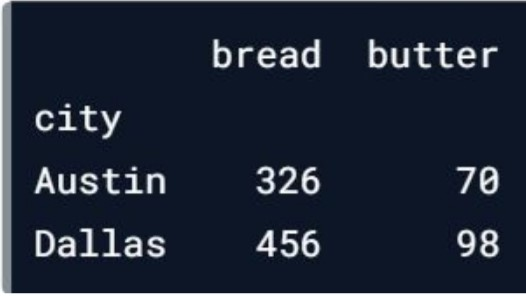
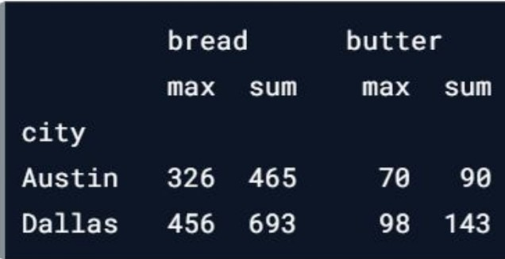

These are my notes from datacamp.

Legend:
* #: Number, used for differentiating variables
* L#: List.
* D#: Dictionary. 
* itr#: Iterable.
* DF#: Dataframe
* mltIdx#: MultiIndex
* idx: Index
* int#: Integer variable

## Pure Python
* Exponentiation: val ** power
* Type conversion: *type*(val), where *type* in {int, float, str, bool}
* Iterables
  * **Loop with Index**: for idx, val in enumerate(itr)
  * **Generators (lazy loading iteration)**
    * Creation: 
      * `gen = iter(L / D / *range(i)*)`
      * `gen = (x for x in list)`
      * `gen = def fx(param): ... for x in param: yield x ...`
    * Use:    val = next(itr)
* Lists
  * **Init with List Comprehension**
    * Format: `[ (value) for (var_name) in (iterable) if (predicate) ]`
      * e.g. [L[0] for elem in list]
  * List of tuples:
    * **Convert L to L of indexed tuples:**
      * `enumerate(itr, start=int1) = [(int1,itr[0]), (int1+1,itr[0])...]`
    * Merge two lists into a list of tuples:
      * `zip(*L1*,*L2*)`
        * returns zipObject: [ (L1[0],L2[0]),  (L1[1],L2[1])... ]
        * Access zipObject contents: (*zipObj)
      * Unzip: `zip(*zipObj)`
  * Count occurrences: `list.count(obj)`
* Dictionaries
  * **Init with Dictionary Comprehension**
    * Format: `{ (key : value) for (var_name) in (iterable) if (predicate) }`
      * e.g. {x : len(x) for x in list}
  * **Init from list of tuples**
    * `dict(zip(L1,L2))`
* Functions:
  * Default params: x=default
  * Flexible list param: `f(*args)`
    * Usage: f(v1,v2,v3...)
  * Flexible dict param: `f(**kwargs)`
    * Usage: f(k1=v1,k2=v2,k3=v3...)
  * Multiple output: 
    * def fx(): return (x, y)
    * Multiple assignment:
      * x,y = fx()
  * Global variables: `global varname`
  * Nested functions:
    * Variables & params of external f() is accessible
    * The function itself can be returned
    * Modify variables from nested f(): `nonlocal varname`
* Functional Programming
  * `map((lambda a: (transformation)), L)`
  * `filter((lambda a: (predicate)), L)`
  * `reduce((lambda a,b: ...), L) = result`
    * Import: `from functools import reduce`
  * The lambda can be replaced with a concrete function
* Lambdas
  * `(lambda (params): (body))`
  * e.g. (lambda a: a+1) ≡ def f(a): return a+1
  * No "return"
  * No multi-line
* Exception Handling
  * try: ... 
  * except: ... 
  * raise *Error*(*msg*)
    * Error = {ValueError, TypeError, YourOwnErrClass}
* I/O
  * Open file:
    * `with open('filepath') as file_var`
      * `file_var.readline()`: returns None if empty
  * Get script directory:
    * `dir_path = os.path.dirname(os.path.realpath(__file__))`
  * Get path to file relative to script directory:
    * `local_file = os.path.join(dir_path, 'path', 'to', 'local_file')`
* Datetime
  * Req: `import datetime as dt`
  * `dt.date.today()`

## Libraries / Modules

### Regex
* **Create Pattern**: `pattern = re.compile(r"regex_pattern")`
* **Match**: `matches = re.match(pattern, str)`
  * Returns None if no matches found
  * **Get found values**: `matches.group(n), n = 0 if no groups defined` 
* 
### Recordlinkage (Join datasets w/o common UID)
* `import recordlinkage`
* Purpose: **Join different datasets when they don't share a unique identifier.** See [Documentation](https://recordlinkage.readthedocs.io/en/latest/ref-index.html)
  1. **Init an indexer**
    * `idxr = recordlinkage.Index()`
  2. Blocking: only **choose pairs of entries that have the same value under specified column** (e.g. "cuisine_type")
    * `idxr.block("col_name")`
  3. **Generate said pairs of indexes** which agree on the equal columns
    * `mltIdx_pairs = idxr.index(df1, df2)`
      * Example pair: MultiIndex([(0,0),(0,1),(0,7),(1,0),(1,4)...])
  4. **Specify the columns to compare** with a Compare object
    * `comp = recordlinkage.Compare()`
      * Then, specify the columns to compare by:
        * `comp.exact('col_nm_in_df1', 'col_nm_in_df2', label='new_lbl_in_new_df')`
          * Entries must **exact match** in the columns
          * e.g. comp.exact('city', 'city', label='city')
        * `comp.string('col_nm_in_df1', 'col_nm_in_df2', label='new_lbl_in_new_df', threshold = dbl_frm_0-1)` (threshold usually 0.8)
        * Entries must be **similar** (in terms of string) in the columns
  5. Apply the Compare object to **get a dataframe highlighting potential matches**
    * `df_pttl_mtchs = comp.compute(mltIdx_pairs, df1, df2)`
      * Structure of df_pttl_mtchs:
        * Index / Col 0: mltIdx_pairs
        * Columns: columns used for comparison
          * exact: 1 if equal else 0
          * string: 1 if threshold met, else 0
  6. **Filter matches** from potential matches
    * `df_mtchs = df_pttl_mtchs[df_pttl_mtchs.sum(axis=1) >= 3]`
      * If the val == 1 then there's a match on that column. This counts the number of matched columns, and filters by that.
      * In this case there were 3 columns so 3 was chosen
  7. **Select matched indexes** for one of the DFs (in this case df2)
      * `idx_df2_mtched = df_mtchs.index.get_level_values(1)`
        * df_pttl_mtchs & df_mtchs use a MultiIndex. 
        * df_mtchs.index.get_level_values(0) = df1's indexes, (1) = df2's indexes
  8. **From df2, remove entries that match df1's entries**
    * `df2_notInDf1 = df2[~df2.index.isin(idx_df2_mtched)]`
  9. **Join df1 and the new df2 entries**
    * `df1.append(df2_notInDf1)`

### fuzzywuzzy (String Comparison)
* **Import**: `from fuzzywuzzy import process`
* **Test similarity:** `process.extract('target_word', arr_of_candidate_words, length_of_arr)`
  * Returns array of tuples: `[('candidate_word', similarity_score), ...]`
    * similarity_score: from 0 - 100, 100 as perfect, 80 as close enough

### missingno (Visualize missing data)
* `import missingno as msno`
* msno.matrix(df_with_missingvals); plt.show()

### scipy.stats (zscore)
* `from scipy.stats import zscore`
* calculate zscore values: `zscore(df['col'])`
  * z-score is the number of standard deviations by which an observation is above the mean - so if it is negative, it means the observation is below the mean.

### Textatistic (Evaluate word readability)
* `from textatistic import Textatistic`
* Compute scores: `scores = Textatistic(article/string).scores`
* Get Flesch score: `scores['flesch_score']`
* Get gunningfog: `scores['gunningfog_score']`

### spacy (tokenization and lemmatization)
* `import spacy`
* Tokenization
```
import spacy

# Load the en_core_web_sm model which comes with the spaCy library (see https://spacy.io/models/en)
nlp = spacy.load('en_core_web_sm')

# Create a Doc object
doc = nlp(gettysburg)

# Generate the tokens
tokens = [token.text for token in doc]
```
* Lemmatization (accuracy dependent on moduel)
```
import spacy

# Load the en_core_web_sm model
nlp = spacy.load('en_core_web_sm')

# Create a Doc object
doc = nlp(gettysburg)

# Generate lemmas (accuracy dependent on model)
lemmas = [token.lemma_ for token in doc]

# Convert lemmas into a string
print(' '.join(lemmas))
```
* Preprocess with lemmatization, removing non alphabeticals
```
# Function to preprocess text
def preprocess(text):
    # Create Doc object
    doc = nlp(text, disable=['ner', 'parser'])
    # Generate lemmas
    lemmas = [token.lemma_ for token in doc]
    # Remove stopwords and non-alphabetic characters
    a_lemmas = [lemma for lemma in lemmas 
            if lemma.isalpha() and lemma not in stopwords]
    
    return ' '.join(a_lemmas)
  
# Apply preprocess to ted['transcript']
ted['transcript'] = ted['transcript'].apply(preprocess)
print(ted['transcript'])
```
* POS (piece-of-speech) tagging 
```
# Load the en_core_web_sm model
nlp = spacy.load('en_core_web_sm')

# Create a Doc object
doc = nlp(lotf)

# Generate tokens and pos tags
pos = [(token.text, token.pos_) for token in doc]
print(pos) 
# Output: [('He', 'PRON'), ('found', 'VERB'), ('himself', 'PRON'), ('understanding', 'VERB') ...
```
* Named Entities Recognition (NER)
```
# Load the required model
nlp = spacy.load('en_core_web_sm')

# Create a Doc instance 
text = 'Sundar Pichai is the CEO of Google. Its headquarters is in Mountain View.'
doc = nlp(text)

# Print all named entities and their labels
for ent in doc.ents:
    print(ent.text, ent.label_)
"""
Output:
    Sundar Pichai ORG
    Google ORG
    Mountain View GPE
"""

# Alternatively:
def find_persons(text):
  # Create Doc object
  doc = nlp(text)
  
  # Identify the persons
  persons = [ent.text for ent in doc.ents if ent.label_ == 'PERSON']
  
  # Return persons
  return persons

print(find_persons(tc))
```
* Word embeddings
  * Compare similarities
  ```
  # Create the doc object
  doc = nlp(sent)

  # Compute pairwise similarity scores
  for token1 in doc:
    for token2 in doc:
      print(token1.text, token2.text, token1.similarity(token2))
  # Similarity between 2 documents
  nlp(doc1).similarity( nlp(doc2) )
  ```

### matplotlib.pyplot (Graphs & Images)
`import matplotlib.pyplot as plt`
* Think of `plt` as some kind of a global variable to attach stuff to
* Change Styles:
  * **Use style**: `plt.style.use(style_name)`
  * **Show available styles**: `plt.style.available`
  * **Improve the spacing between subplots**: `plt.tight_layout()`
  * **Hide gridlines**: `plt.grid('off')`
  * **Hide axes**: `plt.axis('off')`
* Graphs
  * Create multiple graphs:
    * Automatically using `plt.subplot(rows, columns, active_subplot_idx)`
      * Call the function with a new `active_subplot_idx` = row x rowlen * column to change the current graph.
        * `active_subplot_idx` starts from 1
    * Specify axes directly: 
    * **Define bounding box (axes)**: `plt.axes([xlower, ylower, width_%, height_%])`, args passed as a list
      * Think of these as rectangle bounds of your current graph.
        * e.g. if you want 2 graphs side-by-side: 
          * First set the axes for the left one `plt.axes([0.05, 0.05, 0.425, 0.9])` 
          * Then plot the left graph `plt.plot(year, physical_sciences, color='blue')`
          * The set the axes for the right one `plt.axes([0.525, 0.05, 0.425, 0.9])`
          * and plot that graph `plt.plot(year, computer_science, color='red')`
  * Plot graph in active subplot:
    * **Plot line**:
    ```
    plt.plot(
        OPTION 1 WITH TWO LISTS: x_positions_of_points, y_positions_of_points, 
        OPTION 2 WITH 1 DATAFRAME: dataframe_of_x_and_y 
        color='blue', 
        label=str     # Used to label the line in the legend
    )
    ```
    * **Scatter**: `plt.scatter(x_data, y_data, label='data', color='red', marker='o')`
    * **Histogram**: 
    ```
    plt.hist(pixels, bins=64, 
        range=(0, 256),   # x-axis range
        normed=True,      # normalized histogram
        cumulative=True,  # cumulative density function instead of probability density function
        color='red', 
        alpha=0.4,
        histtype='bar'      # https://matplotlib.org/3.2.1/gallery/statistics/histogram_histtypes.html
    )

    # Alternatively
    dataframe.hist()
    ```
    * **Empirical CDF**:  
    ```
    def ecdf(data):
        """Compute ECDF for a one-dimensional array of measurements."""
        # Return x and y data
        return (np.sort(data), np.arange(1, len(data)+1) / n)
    
    x1, y1 = ecdf(data_list1)
    x2, y2 = ecdf(data_list2)
    plt.plot(x1, y1, marker='.', linestyle = 'none')
    plt.plot(x2, y2, marker='.', linestyle = 'none') # marker='D' for diamonds
    plt.legend(('data 1', 'data 2'), loc='lower right')
    plt.show()
    ```
    * **Boxplot**: `dataframe.boxplot(column = [y_axis_col_values], by=[x_axis_col_values])`
    * **Add title**: `plt.title(str)`
    * **Change x and y labels**: `plt.xlabel(str)` and `plt.ylabel(str)`
    * **Change x and y limits (set range)**: `plt.xlim(lower,upper)` and `plt.ylim(lower,upper)`
      * Inclusive
      * **Change both at the same time**: `plt.axis((x_lower,x_upper,y_lower, y_upper))`
    * **Configuring xticks / yticks**: `plt.xticks(rotation=degs)` and `plt.yticks(rotation=degs)`
      * ticks: the markers showing the coordinates on the x and y axis
      * rotation: angle at which ticks are displayed
  * **Add legend**: `plt.legend((label1, label2, ...), loc='lower center')`
  * **Overlay plots**: `plt.twinx()`
    * Use plt.twinx() to overlay plots with different vertical scales on a common horizontal axis.
  * **Annotate**
    ```
    plt.annotate(text, 
        xy=(x_pos, y_pos),    # xy of value you're pointing to
        xytext=(x_pos, y_pos), 
        arrowprops=dict(facecolor='black')
    )
    ```
  * **2D histogram**:
    * `plt.hist2d(horizontal_data, vertical_data, bins=(x_cols, y_rows), range=((x_min, x_max), (y_min, y_max)))`
    * Range is optional
    * Instead of plotting the points directly on a graph, you turn it into something of a density map; the graph is split into a grid, and boxes with a lot of points will have a color of higher intensity.
  * **2D hex histogram**:
    * `plt.hexbin(horizontal_data, vertical_data, gridsize=(x_cols, y_rows), extent=(x_min, x_max, y_min, y_max))`
  * **Display points w/ color**: `plt.pcolor(2D_arr,...)`
    * Add param `cmap='Blues'` to config colormapping to Blues
  * **Display color and intensity mapping**: `plt.colorbar()`
    * Note that the bottom left part of the image maps to the top left part of the numpy array
  * **Display points as contours**: `plt.contour(X, Y, Z, contour_count, cmap='color_map')`
    * Filled: `plt.contourf(...)`
    * [See](https://jakevdp.github.io/PythonDataScienceHandbook/04.04-density-and-contour-plots.html)
* Images
  * **Load image**: `npRGB = plt.imread(filepath)`
  * **Display image**: 
  ```
  plt.imshow(npRGB,
      cmap='gray',
      extent=(-1, 1, -1, 1) # horizontal extent from -1 to 1, vertical extent from -1 to 1
      aspect=1              # aspect ratio (# of vertical pixels : # of horizontal pixels). 
                            # \lt 1 means img is squashed downwards; \gt 1 means img is stretched upwards
  )
  ```
    * Add cmap if only 1 channel
  * **RGB to monochannel**: `npRGB.sum(axis=2)`
  * Others:
    * **Split RGB into channels:**
      * `red, green, blue = img[:,:,0], img[:,:,1], img[:,:,2]`
      * **Flatten monochannel image (without modifying values) into 1-D array**: `image.flatten()`
    * Normalize intensity:
      * `256*(img-img.min())/(img.max()-img.min())`
* Export:
  * **Show on GUI**: `plt.show()`
  * **Save to file**: `plt.savefig(filepath)`

### Seaborn (Graphs)
* `import seaborn as sns`
* Set default style: `sns.set()`
* **Simple linear regression**:
  ```
  sns.lmplot(x='x_pos_col_in_df', y='y_pos_col_in_df', data=dataframe
      hue='categorical_col_in_df', # This col is categorical; will be used to group the points by colour
      row='groupby_row_wise'
      palette='Set1'
  )
  ```
  * straight line best fit
  * hue: e.g. you have a col "gender" that allows only {'M','F'}. 
    * Graph will color points that have value 'M' to one color, and 'F' to another color (i.e. groupby)
  * row: same purpose as hue, but groupby row-wise
    * i.e. Segregate points by each category and plot a separate graph for each
  * plots on current plt graph. Use `plt.show()` to show 
* **2nd order regression**: 
  ```
  sns.regplot(x='x_col_in_df', y='y_col_in_df', data=dataframe,
      color='green', 
      scatter=None,         # Set scatter to None if you don't want to plot the scatter points; else ignore this line
      order=2,              # 1 for simple lin. regr., 2 for 2nd order etc
      label='legend_label'  # label for legend
  )
  ```
  * curved line best fit
  * 
* **Residual plot**: `sns.residplot(x='x_col_in_df', y='y_col_in_df', data=dataframe, color=color_str)`
  * Visualize how far datapoints diverge from the regression line (a "residual" is the distance from a datapoint to the line)
* **box plot**: `sns.boxplot(x='east_west', y='dem_share', data=df_all_states)`
* **Strip plot**: A scatter plot where the x axis represents a categorical variable.
  ```
  sns.stripplot(x='x_col_in_df', y='y_col_in_df', data=df,
      size = n,   # Size of dots
      jitter=True # Useful when many points overlap, easier to see distribution. 
  )
  ```
  * [Documentation](https://seaborn.pydata.org/generated/seaborn.stripplot.html)
* **Swarm plot**: Similar to strip plot, but the points visually spread out to avoid overlap
  ```
  sns.swarmplot(x='x_col_in_df', y='y_col_in_df', data=df,
      orient = 'h'/'v'  # h: y is now the categorical var. v: same as stripplot
      size = n,         # Size of dots
      hue='col',        # Categorical column to colour points by
  )
  ```
* **Violin plot**: Similar to a box plot, with the addition of a rotated kernel density plot on each side
  ```
  sns.violinplot(x='x_col_in_df', y='y_col_in_df', data=df,
      color='lightgray',  # If you want all violins to be of the same color
      inner=None          # Points are visualized in the center of each x coord. inner=None to only show the violin body.
  )
  ```
* **Joint plot**: Main plot in the middle defined by `kind`, combined with histograms aligned to the x and y axis at the side.
  ```
  sns.jointplot(x='hp', y='mpg',data=auto,
      kind = 'scatter' | 'reg' | 'resid' | 'kde' | 'hex'
  )
  ```
  * kind='scatter': scatter plot of the data points
  * kind='reg': regression plot (default order 1)
  * kind='resid': residual plot
  * kind='kde': kernel density estimate of the joint distribution
  * kind='hex': hexbin plot of the joint distribution

* **Pair(wise) plot**: Take every pairwise combination of every non-categorical column in dataframe and plot main plot + histogram.
  ```
  sns.pairplot(df, kind = 'scatter' | 'reg' | 'resid' | 'kde' | 'hex'
      hue = 'categorical_col' # Categorical column to colour points by
  )```

* **Heatmap**: Good for visualizing 2D arrays (e.g. covariance matrices)
  ```
  sns.heatmap(df)
  ```

### scikit-learn
`import sklearn`
**train_test_split**
* `from sklearn.model_selection import train_test_split`
* Use stratified sampling to split up the dataset according to the categorical_y_data dataset
  * `X_train, X_test, y_train, y_test = train_test_split(data_x, categorical_y_data, stratify=categorical_y_data, test_size=<0.0 - 1.0>)`
  * Stratified: Make the distribution of each feature as close as possible to the original in the training and test sets
  * 75% into training set and 25% into test set

**Pipelines**
* `from sklearn.pipeline import Pipeline`
* Usage: 
```
pipe = Pipeline([
  ('scaler',StandardScaler()),              # 0
  ('reducer', PCA()),                       # 1
  ('classifier', RandomForestClassifier())  # 2
])
# pipe.fit(Xtrain, ytrain)
# pipe.fit_transform(...)
# accessing the tuple ('scaler', scaler_obj): pipe[0]
```

**Concepts**

Data Standardization (normalization):
* Preprocessing task performed on numerical, continuous data to **make it normally distributed**. Standardize (assuming linear space) when:
  * 1. Using a model that is in a linear space (any kind of model that uses a linear distance metric or operates in a linear space like k-nearest neighbors, linear regression, or k-means clustering). The model is assuming that the data and features you're giving it are related in a linear fashion, or can be measured with a linear distance metric. 
  * 2. When a feature or features in your dataset have high variance ; if a feature in your dataset has a variance that's an order of magnitude or more greater than the other features, this could impact the model's ability to learn from other features in the dataset. 
  * 3. When features are of different scales e.g. height & weight. To compare these features, they must be in the same linear space, and therefore must be standardized in some way. 
* **StandardScaler**: For Data Standardization
  * Finds mean and centers data around it (no limit to max / min)
  * **Import**: `from sklearn.preprocessing import StandardScaler`
  * **Creation**: `ss = StandardScaler()`
  * **Fit**: `ss.fit(training_df_column)` (Call before transform)
    * only fit with training data to avoid data leakage (won't have access to test data)
  * **Normalize scale**: `ss.transform(dataframe_subset (columns))`
    * transform training data
    * Use `.fit_transform(...)` to fit, then transform data
* **MinMaxScaling**: For normalizing linear values to 0-1 by squashing min and max range to 0-1
  * Use only when you know your data has a strict lower and upper bound
  * **Import**: `from sklearn.preprocessing import MinMaxScaler`
  * **Creation**: `MM_scaler = MinMaxScaler()`
  * **Fit**: `MM_scaler.fit(training_df_column)` (Call before transform)
    * only fit with training data
  * **Transform**: `resultantCol = MM_scaler.transform(training_df_column)`
    * transform training data
    * Use `.fit_transform(...)` to fit, then transform data
* **Log transform**: 
  * **Import**: `from sklearn.preprocessing import PowerTransformer`
  * **Creation**: `pow_trans = PowerTransformer()`
  * **Fit**: `pow_trans.fit(training_df_column)` (Call before transform)
    * only fit with training data
  * **Normalize scale**: `pow_trans.transform(dataframe_subset (columns))`
    * transform training data
    * Use `.fit_transform(...)` to fit, then transform data

Data Sanitization
* Outlier Removal
  * Quantile (percentage) based
    * 1. Find quantile: `quantile = dataframe['col'].quantile(0.95)`
    * 2. Trim: `trimmed_df = dataframe[dataframe['col'] < quantile]`
  * standard dev based
    * Get mean and std dev
    * Calculate cutoff e.g. `3 * std`, and lower (`mean - cutoff`) + upper (`mean + cutoff`) bounds
    * Trim outliers `df[(df['col'] < upper) & (df['col'] > lower)]`
* Text preprocessing tricks
  * Trim whitespace
  * Remove punctuation
  * Remove commonly occurring words or stopwords
  * Expanding contracted words (e.g. can't)
  * Remove special characters such as numbers and emojis.
  * Done using **tokenization** (split corpus by space)
  * Done by **lemmatization** (convert word into base form e.g. "eating" "ate" into "eat")


Feature Engineering
* Descript: Creation of new features from existing features (e.g. string/timestamp subsetting, aggregate numeric data across columns etc)
* **LabelEncoder**: Converting labelled column into {0,1} column
  * **Creation**: `enc = LabelEncoder()`
  * **Encode as binary**: `new_col = enc.fit_transform(dataframe['col'])`
* **One Hot Encoding**: Convert column of categories into 2D binary array
  * Do this instead of mapping categories to numbers, to avoid encoding ordering to the categories
* **Dummy Encoding**: Same as one-hot encoding, but the first column dropped. Membership to the first column is indicated (implied) when all OHE are set to 0.
  * **Both OHE & Dummy use the same command:**
  ```
  pd.get_dummies(dataframe,
      columns = [column_labels], 
      drop_first=True, 
      prefix='col_prefix'
  )
  ```
* **CountVectorizer**: Vectorize text with word count
  * Bag of words (BoW): Given a vocabulary e.g. ['a','sock','dog'], convert corpus into a dictionary counting number of times the words occur e.g. [0, 2, 1]
  * **Import**: `from sklearn.feature_extraction.text import CountVectorizer`
  * **Creation**: 
  ```
  cv = CountVectorizer(
      lowercase = bool,
      stop_words = 'english' # optional for excluding stop words in the BoW vector
      min_df: 0-1,   # Use only words that occur in more than this percentage of documents. This can be used to remove outlier words that will not generalize across texts.
      max_df: 0-1,   # Use only words that occur in less than this percentage of documents. This is useful to eliminate very common words that occur in every corpus without adding value such as "and" or "the".
      ngram_range = (start<min=1>, stop) # don't forget curse of dimensionality
  )
  ```
  * **Fit**: `cv.fit(speech_df['text_clean'])`
  * **Get word list**: `cv.get_feature_names()` 
  * **Transform**: `cv_transformed = cv.transform(speech_df['text_clean'])`
    * returns sparse array
    * **To array**: `cv_transformed.toarray()`
      * 1 row per block of text and a column for each of the features generated by the vectorizer
* **tf-idf**: Term Frequency - Inverse Document Frequency vector
  * Descript: Text vectorization converts text to numerical input
  * $w_{i,j} = tf_{i,j} \cdot log(\frac{N}{df_i})$
    * $w_{i,j}$: weight of term i in document j
    * $tf_{i,j}$: term frequency of i in j
    * N: # of documents in corpus
    * $df_i$: # of documents containing term i
  * [(# of word occurences) / (total words in document)] / log(# of docs word is in / total number of docs)
    * Divide proportion of word occurence by proportion that it appears in all documents
      * reduces value of common words
  * **Import**: `from sklearn.feature_extraction.text import TfidfVectorizer`
  * **Creation**: 
  ```
  tfidf_vec = TfidfVectorizer(
    max_features=n, 
    stop_words='english',
    ngram_range = (start, stop) # Adding some ordering. bi-gram ("not happy") tri-gram ("never not happy"). Tries to fix bag of words problem
  )
  ```
    * stop_words will remove common words like 'the'
  * **Transform**: `text_tfidf = tfidf_vec.fit_transform(title_text)`
    * returns sparse array
    * **To array**: `cv_transformed.toarray()`
    * Indices and weights will be stored in the tfidf vector `text_tfidf`
    * Vocabulary and weights will be stored in the TfidfVectorizer `tfidf_vec`.
    * Example
    ```
    # Instantiate TfidfVectorizer
    tv = TfidfVectorizer(max_features=100, stop_words='english')

    # Fit the vectroizer and transform the data
    tv_transformed = tv.fit_transform(train_speech_df['text_clean'])

    # Transform test data
    test_tv_transformed = tv.transform(test_speech_df['text_clean'])

    # Create new features for the test set
    test_tv_df = pd.DataFrame(test_tv_transformed.toarray(), 
                              columns=tv.get_feature_names()).add_prefix('TFIDF_')
    print(test_tv_df.head())
    ```
    * **Get word list**: `cv.get_feature_names()` 
    * **Get word to index map**: `str_idx_map = tfidf_vec.vocabulary_`
      * **Get index to word map**: `idx_str_map = {v:k for k,v in tfidf_vec.vocabulary_.items()}`
    * **Get weights for every word in row**: `text_tfidf[row_index].data`
      * If row_index is not number, use `iloc[n]`
    * **Get indices for every word in row**: `text_tfidf[row_index].indices`
      * **Get indices to weights map for row**: `idx_wgts_map = dict( zip(text_tfidf[row_index].indices, text_tfidf[row_index].data)`
        * **Get word to weights map for row**: `str_wgts_map = {idx_str_map[i]:idx_wgts_map[i] for i in text_tfidf[row_index].indices}`
    * **Get indices of top n weights**: `top_n_idx = pd.Series(str_wgts_map).sort_values(ascending=False)[:top_n].index`
    * **Get words of top n weights**: `top_n_str = [idx_str_map[i] for i in top_n_idx]`
* Word Embeddings: Comparing not just the word frequencies, but the meanings of each word
  * Use spacy


Feature Selection
* Removing **redundant** (noisy|correlated|duplicated) features.
  * e.g. features that generated an aggregate statistic
* **t-SNE**: t-Distributed Stochastic Neighbour Embedding. 
  * Used to significantly reeduce dimensions of a dataset, so you can visually explore the patterns in a high dimensional dataset.
  * `from sklearn.manifold import TSNE`
  * **Init**: `m = TSNE(learn_rate_eg_50)`
  * **Fit & Transform**: `tsne_features = m.fit_transform(df_numeric)`
* **To avoid overfitting**: "number of observations should increase exponentially with the number of features"
  * Too few observations: model overfits by memorizing the test data
  * Curse of dimensionality: when the number of observations is too high to satisfy


Feature Extraction
* Transform data into new features
* **Dimensionality Reduction**: Reduce feature space
  * Turning numericals into binned vals / binary
  * **Feature selection:** Drop irrelevant features
  * 1. Remove redundant features (columns) where variance too small
    * 1. `from sklearn.feature_selection import VarianceThreshold`
    * 2. `sel = VarianceThreshold(threshold=0.005)`
    * 3. Normalize variance for all columns: `norm_df = df / df.mean()`
    * 4. Fit VarianceThreshold: `sel.fit(norm_df)`
    * 5. Get mask: `mask = sel.get_support()`
    * 6. Get columns with variance at least 0.005: `df.loc[:, mask]`
      * 0.005 not fixed; check the variances of your features before truncating
  * 2. Remove features that are strongly correlated or duplicated
    * 1. Get corr matrix (abs): `corr = df.corr().abs()`
    * 2. Create True/False mask for upper triangle: `mask = np.triu(np.ones_like(corr, dtype=bool))`
    * 3. Visualize with mask: `sns.heatmap(df.corr(), mask=mask, cmap=cmap, center=0, linewidths=1, annot=True, fmt=".2f"); plt.show()`
    * 4. Apply T/F mask; replace sections that are True with NAN: `tri_df = corr_matrix.mask(mask)`
    * 5. Get cols that are highly correlated: `to_drop = [c for c in tri_df.columns if any(tri_df[c] >  0.95)]`
    * 6. Drop: `reduced_df = df.drop(to_drop, axis=1)`
  * 3. Remove features with too many missing values
    * `mask = school_df.isna().sum() / len(school_df) < 0.5`
    * `reduced_df = df.loc[:, mask]`
  * 4. **Recursive Feature Elimination**: Remove features that have little effect on prediction (by seeing its weights)
    * `from sklearn.feature_selection import RFE`
    * Init: `rfe = RFE(estimator=LogisticRegression(), n_features_to_select=3, verbose=1, step=n_features_to_drop_per_iter)`
      * Other estimators: `RandomForestClassifier(), GradientBoostingRegressor()`
    * Fit: `rfe.fit(X_train, y_train)`
    * Columns ranked (highest = weakest): `print(dict(zip(X.columns, rfe.ranking_)))`
    * Columns kept (`rfe.support_` is a mask): `print(X.columns[rfe.support_])`
    * Test (using accuracy_score): `accuracy_score(y_test, rfe.predict(X_test))`
  * **Feature Extraction:** Combine features
  * 1. **Principle Component Analysis (PCA)**: linear transformation to uncorrelated space
    * 
    * Change basis: 1 to represent variance (yellow vector), 1 to represent magnitude (red vector). Can be used to represent each point. Coordinates in this new reference system are called **principle components**.
    * Vectors ranked by importance based on how well they explain variance (e.g.the red one would be most important as it best explains the variance)
    * Variance captured in a meaningful way by combining features into components
    * Number of components = number of input features
    * Difficult to interpret components, should be left to the end-of-preprocessing journey
    * **Creation**: `pca = PCA(n_components=num_or_variance_ratio)`
    * **Transform**: `transformed_X = pca.fit_transform(dataframe_X)`
    * **Components** (vectors of weightage per feature): `pca.components_`
    * **How much variance is explained by each component**: `pca.explained_variance_ratio_`
    * **Tagging component to column**: 
    ```
    vectors = pipe.steps[1][1].components_.round(2)
    # Print feature effects
    print('PC 1 effects = ' + str(dict(zip(poke_df.columns, vectors[0]))))
    ``` 
* POS tagging (Parts of Speech) (e.g. Pronoun, verb, article, noun)
* Named Entity Recognition (NER) (e.g. Person, Organization)

Models

**K-Nearest Neighbour (KNN)** Classifier. [See](https://www.datacamp.com/community/tutorials/k-nearest-neighbor-classification-scikit-learn)
* Return label of closest neighbour as prediction
* **Import**: `from sklearn.neighbors import KNeighborsClassifier`
* **Create**: `knn = KNeighborsClassifier(n_neighbors=3)`
* **Training**: `knn.fit(X_train (features), y_train (labels))`
* **Scoring**: `knn.score(X_test, y_test)`
* **Predict**: `predicted = knn.predict(input)`

**Naive Bayes** Classifier: 
* Assumes features are independent, works well with high-dimensional text data
* **Training**: `nb.fit(X_train (features), y_train (labels))`
* **Scoring**: `nb.score(X_test, y_test)`
* **Predict**: `predicted = nb.predict(input)`

**Multinomial Naive Bayes** classifier (0 or 1):
* Init: `clf = MultinomialNB()`
* Fit: `clf.fit(X_train_BoW, y_train)`
* Scoring: `accuracy = clf.score(X_test_bow, y_test)`
* Prediction example: 
```
# Predict the sentiment of a negative review
review = "The movie was terrible. The music was underwhelming and the acting mediocre."
prediction = clf.predict(vectorizer.transform([review]))[0]
```

**Support Vector Classifier**
* `from sklearn.svm import SVC`
* `from sklearn.metrics import accuracy_score`
* Init: `svc = SVC()`
* Fit: `svc.fit(X_train, y_train)`
* Scoring: `accuracy = accuracy_score(y_test, svc.predict(X_test))`
* Check overfit: `accuracy_train = accuracy_score(y_train, svc.predict(X_train))`

**Logistic Regression**
* Features need to be scaled first using standardscaler
* Init: `lr = LogisticRegression()`
* Fit: `lr.fit(X_train_std, y_train)`
* Predict: `y_pred = lr.predict(X_test_std)`
* Weights: `print(dict(zip(X.columns, abs(lr.coef_[0]).round(2))))`

**Random Forest Classifier**
* Algorithm to calculate feature importance by averaging how often features are used to make decisions in multiple random decision trees
* Init: `rf = RandomForestClassifier()`
* Fit: `rf.fit(X_train, y_train)`
* Predict Accuracy: `acc = accuracy_score(y_test, rf.predict(X_test))`
* Get feature importances mask: `mask = rf.feature_importances_ > 0.1`
  * Select by mask: `df.loc(:, mask)`
* Use with RFE: `RFE(estimator=RandomForestClassifier(), ...)

**Linear Regression**
* $y = c + w_1x_1 + w_2x_2 + ... w_nx_n$ + error
* `from sklearn.linear_model import LinearRegression`
* init: `lr = LinearRegression`
* fit: `lr.fit(X_train, y_train)`
* coefficients ($w_i$): `lr.coef_`
* How it works:
  * Minimize loss function: Mean Squared Error (MSE)
  * Avoid overfitting by using **regularization**: goal is to keep model simple by keeping coefficients low
    * Regularization term: $\alpha (|\beta_1| + |\beta_2| + ... |\beta_n|)$
    * Alpha: trade-off between overfitting and keeping model simple. Too low = overfit, Too high = inaccurate model
    * Final regularized expression: $y = c + w_1x_1 + w_2x_2 + ... w_nx_n$ + error + regularization_term
    * **Lasso**: 1 linear regression model that uses regularization
    * `from sklearn.linear_model import Lasso`
    * Ensure X_data is standardized using StandardScaler
    * Init: `la = Lasso(alpha={0.0-1.0}, random_state={0,1})`
    * Fit: `la.fit(X_train_std, y_train)`
    * coeffs: `la.coef_ `
    * score (R squared): `la.score(X_test_std, y_test)`
    **LassoCV**: Cross Validation to find optimal alpha value (Same syntax as above)


Comparing similarity between vectors

**Cosine Similarity**:
* `from sklearn.metrics.pairwise import cosine_similarity`
* Ratio of (dot product of vectors) and (product of magnitude of vectors)
* Range of values from -1 to 1, but since NLP vectors are non-neg, it's 0 - 1
* Calcualting **pairwise** cosine similarity matrix: `cosine_similarity(A, B)` e.g. `cosine_similarity(tfidf_mat, tfidf_mat)`
  * A and B can be the same `tfidf_matrix = tfidf_vectorizer.fit_transform(corpus)` if you want to check similiarity across entries
* When comparing tf-idf vectors, their magnitude is 1, so use `linear_kernel`
* `from sklearn.metrics.pairwise import linear_kernel`

Bootstrap
* Given a sample of data, resample from this data
  * **Bootstrap sample**: array of resampled data
  * **Bootstrap replicate**: summary statistics (e.g. mean) of this array of resampled data
  * You can resample using `np.random.choice(..)`

## Numpy
* **Import**: ```import numpy as np```
* **Numpy Array**
  * Creation
    * **Create array**: ```np.array(list)```
    * **Create empty**: `np.empty(shape)`
    * **Create empty like**: `np.empty_like(list)`
  * Attributes
    * **Shape**: `np_list.shape`
  * Unary Operations
    * **Transpose array**: `np.transpose(list)`
    * **Reshape**: `np.reshape(np_array, (new, shape, dimensions))`. [Doc](https://numpy.org/doc/stable/reference/generated/numpy.reshape.html)
  * Operation with scalar
    * **Slicing 2D numpy array (get row / get col)**: `np_2d[row,:]`, `np_2d[:,col]`
    * **Mass multiplication**: `np_list *= val`
    * **Iterate 2D array as 1D**: `for x in np.nditer(np_2d_arr)`
  * Operations involving two numpy arrays
    * **Mass operation**: `np_list3 = np_list1 / np_list2`
    * **Union**: `np.logical_and(arr1, arr2)`
    * **Intersect**: `np.logical_or(a1,a2)`
    * **Negation of numpy arr**: `np.logical_not(a1,a2)`
    * **Concat**: `np.concatenate([list1, list2,...])`
  * Operations involving boolean arrays
    * **Generate boolean array by applying condition to array**: `bool_val = np_list > val`
    * **Subsetting with bool array**: `np_list[bool_val]`
  * Aggregation Operations
    * **Mean**: `np.mean(np_list)`
    * **Median**: `np.median(np_list)`
    * **Std Dev**: `np.std(np_list)`
      * **Standard Error (of the mean)**: `np.std(data) / np.sqrt(len(data))`
        * "Standard deviation (SD) measures the dispersion of a dataset relative to its mean."
        * "Standard error of the mean (SEM) measured how much discrepancy there is likely to be in a sample's mean compared to the population mean."
        * [See more](https://www.investopedia.com/ask/answers/042415/what-difference-between-standard-error-means-and-standard-deviation.asp)
    * **Variance**: `np.var(np_list)`
    * **Covariance Matrix**: `np.cov(np_list1, np_list2)`
      * [0,0]: x.var(), [1,1]: y.var(), [0,1] = [1,0]: covariance
      * mean of the distances from the mean (negative or positive, showing how correlated x and y are)
      * 
    * **Pearson Correlation Coefficient**: `np.corrcef(np_list1, np_list2)`
      * * [0,0]: 1, [1,1]: 1, [0,1]: correlation coeff
      * covariance / (x.std * y.std)
      * variability due to codependence / (interpendent variability)
* **Numpy Random**
  * **Init with Seed**: `np.random.seed(seed)`
  * **Generate Float** 0-1: ` np.random.random()`
  * **Generate Integer**: `np.random.randint(lowerIncl, upperExcl)`
  * **Binomial**: `np.random.binomial(n, p, size=sample_size)`
  * **Poisson**: `np.random.poisson(mean, size=sample_size)`
  * **Exponential**: `np.random.exponential(mean, size=sample_size)`  
  * **Normal Distribution**: `np.random.normal(mean, std, size=sample_size)`
    * tails are very unlikely; real datasets can have extreme outliers, normal distribution may not be best descriptor for data
  * **Permutate (shuffle)**: `np.random.permutate(list)`
    * If we can assume that two samples (e.g. Ohio and PA) share the same distribution, then we can `concatenate` them, permutate (shuffle), then split the samples into the same sizes to get new samples. These are called **permutation samples**
* **Numpy Definitions**
  * **NaN**: `np.nan`
* **Numpy Operations**
  * **Cumulative Sum**: `np.cumsum(list)`
  * **Log10**: `np.log10(nd_arr or dataframe)`
  * **1D interpolation**: [doc](https://numpy.org/doc/stable/reference/generated/numpy.interp.html)
  * **Calculate Percentiles**: `np.percentile(np_data, np_array_of_percentiles_zero_to_hundrd)`
    * e.g. 95% confidence interval: `np.percentile(data, [2.5, 97.5])`
    * **Confidence Interval**: draw_bs_reps,then take percentile
  * **Generate range as list**: `numpy.arange([start=0, ]stop, [step=1])`
  * **least squares**: `slope, intercept = np.polyfit(x, y, deg_of_poly_to_fit<1>)`
  * **Bootstrap samping (resampling with replacement)**: `np.random.choice(arr_data, size=n)`
    * Imagine this as t-test but simulate by resampling [See also](https://stats.stackexchange.com/questions/128987/why-would-i-want-to-bootstrap-when-computing-an-independent-sample-t-test-how#:~:text=Both%20the%20t%2Dtest%20and,of%20the%20test%20statistic%20is.&text=The%20advantage%20of%20the%20bootstrap,assumptions%20needed%20by%20parametric%20methods.)
    * **Pairs Bootstrap**: resample with replacement x and y coords. that cannot be separated
    * **Hypothesis testing**:
    * Compute mean of combined data set, Shift the samples, Get bootstrap replicates of shifted data sets, Compute replicates of difference of means: bs_diff_replicates, Compute the p-value

    ```
    # Helper functions used in datacamp
    def bootstrap_replicate_1d(data, func):
        """Generate bootstrap replicate of 1D data."""
        bs_sample = np.random.choice(data, len(data))
        return func(bs_sample)

    def draw_bs_reps(data, func, size=1):
        """Draw bootstrap replicates."""

        # Initialize array of replicates: bs_replicates
        bs_replicates = np.empty(size)

        # Generate replicates
        for i in range(size):
            bs_replicates[i] = bootstrap_replicate_1d(data, func)

        return bs_replicates

    def draw_bs_pairs_linreg(x, y, size=1):
        """Perform pairs bootstrap for linear regression."""

        # Set up array of indices to sample from: inds
        inds = np.arange(0, len(x))

        # Initialize replicates: bs_slope_reps, bs_intercept_reps
        bs_slope_reps = np.empty(size)
        bs_intercept_reps = np.empty(size)

        # Generate replicates
        for i in range(size):
            bs_inds = np.random.choice(inds, size=len(inds))
            bs_x, bs_y = x[bs_inds], y[bs_inds]
            bs_slope_reps[i], bs_intercept_reps[i] = np.polyfit(bs_x, bs_y, 1)

        return bs_slope_reps, bs_intercept_reps

    def draw_bs_pairs(x, y, func, size=1):
        """Perform pairs bootstrap for a single statistic."""

        # Set up array of indices to sample from: inds
        inds = np.arange(len(x))

        # Initialize replicates: bs_replicates
        bs_replicates = np.empty(size)

        # Generate replicates
        for i in range(size):
            bs_inds = np.random.choice(inds, len(inds))
            bs_x, bs_y = x[bs_inds], y[bs_inds]
            bs_replicates[i] = func(bs_x, bs_y)

        return bs_replicates

    def permutation_sample(data1, data2):
        """Generate a permutation sample from two data sets."""

        # Concatenate the data sets: data
        data = np.concatenate([data1, data2])

        # Permute the concatenated array: permuted_data
        permuted_data = np.random.permutation(data)

        # Split the permuted array into two: perm_sample_1, perm_sample_2
        perm_sample_1 = permuted_data[:len(data1)]
        perm_sample_2 = permuted_data[len(data1):]

        return perm_sample_1, perm_sample_2
    def draw_perm_reps(data_1, data_2, func, size=1):
        """Generate multiple permutation replicates."""

        # Initialize array of replicates: perm_replicates
        perm_replicates = np.empty(size)

        for i in range(size):
            # Generate permutation sample
            perm_sample_1, perm_sample_2 = permutation_sample(data_1, data_2)

            # Compute the test statistic
            perm_replicates[i] = func(perm_sample_1, perm_sample_2)

        return perm_replicates
    
    # In null hypothesis significance testing, the p-value[note 1] is the probability of obtaining test results at least as extreme as the results actually observed, under the assumption that the null hypothesis is correct.
    # https://en.wikipedia.org/wiki/P-value
    def p_value(new_samples, true_value):
        return np.sum(new_samples <= true_value) / 10000

    # One-sample bootstrap hypothesis test example from datacamp
    # Make an array of translated impact forces: translated_force_b
    translated_force_b = force_b + (0.55 - force_b.mean())

    # Take bootstrap replicates of Frog B's translated impact forces: bs_replicates
    bs_replicates = draw_bs_reps(translated_force_b, np.mean, 10000)

    # Compute fraction of replicates that are less than the observed Frog B force: p
    p = np.sum(bs_replicates <= np.mean(force_b)) / 10000

    # Print the p-value
    print('p = ', p)

    # Two-sample bootstrap hypothesis test example from datacamp
    # Compute mean of all forces: mean_force
    mean_force = forces_concat.mean()

    # Generate shifted arrays
    force_a_shifted = force_a - np.mean(force_a) + mean_force
    force_b_shifted = force_b - np.mean(force_b) + mean_force 

    # Compute 10,000 bootstrap replicates from shifted arrays
    bs_replicates_a = draw_bs_reps(force_a_shifted, np.mean, 10000)
    bs_replicates_b = draw_bs_reps(force_b_shifted, np.mean, 10000)

    # Get replicates of difference of means: bs_replicates
    bs_replicates = bs_replicates_a - bs_replicates_b

    # Compute and print p-value: p
    p = np.sum(bs_replicates > empirical_diff_means) / 10000
    print('p-value =', p)
    ```
  * **A/B Testing**: Hypothesis testing, but testing the difference
  ```
  # Compute the observed difference in mean inter-no-hitter times: nht_diff_obs
  nht_diff_obs = diff_of_means(nht_dead, nht_live)

  # Acquire 10,000 permutation replicates of difference in mean no-hitter time: perm_replicates
  perm_replicates = draw_perm_reps(nht_dead, nht_live, diff_of_means, 10_000)


  # Compute and print the p-value: p
  p = np.sum(perm_replicates <= nht_diff_obs) / 10000
  print('p-val =', p)
  # "Your p-value is 0.0001, which means that only one out of your 10,000 replicates had a result as extreme as the actual difference between the dead ball and live ball eras. This suggests strong statistical significance. "
  ```
  * **Hypothesis Testing for correlation**:
    * Do a permutation test: Permute the x values but leave the y values fixed to generate a new set of (x,y) data. It is exact because it uses all data and eliminates any correlation because which x value pairs to which y value is shuffled.
  * **Interpolation:** `np.interp(xcoords_to_interpolate, data_xcoords, data_ycoords, left=None, right=None, period=None)`
* **Generate uniformly spaced list**: `np.linspace(lower_lim, upper_lim, number_of_items)`
* **Meshgrid: create a grid by using coordinates of each dimension**: `np.meshgrid(columns, rows)`
  * [See](https://stackoverflow.com/a/42404323)

## Pandas
* **Import**: `import pandas as pd`
#### Series (Pandas labelled list)
* **From list**: `pd.Series(array, ..., index=arr)`
#### DataFrame (Pandas labelled excel sheets / dictionaries)
Creation / Conversion
* **From Dictionary**: ```pd.DataFrame(dict)```
* **From CSV File**: 
  ```
  dataframe = pd.read_csv(string_filename, 
      delimiter   = str,          # The shorthand 'sep' serves the same purpose
      header      = line_no_start_of_data, 
      index_col   = i, # Column to use as row labels of the df. Set to False to force pandas not to use the first column as the index, or to a col name if you want to use that col

      [chunksize   = n, 
      names       = new_col_labels_list, 
      comment     = str_prefix, 
      parse_dates = [date_col...]
  )
  ```
  * Note that dataframes are iterables, so you can use "next(iterable)" on them (to get them in the chunksize)
* **Converting to set**: `set(df['col'])`
* **add_prefix to all cols**: `df.add_prefix(str)`

Accessing / Selection
* **For Loop for each row** (note that row is a dataframe / dictionary)
  * `for idx, row in df.iterrows(): ...`
* Slicing
  * **Get column as Series**: `dataframe["column"]`
    * **Convert series to numpy.ndarray**: `series.values`
  * **Extract columns from DF**: `dataframe[["column",...]]`
    * **Dataframe as rows**: `dataframe[startIdxIncl: endIdxExcl]`
* Array based selection
  * **Select by label**: 
    * `dataframe.loc[label]` (transposed / series / numpy array)
    * `dataframe.loc[[rowLbl1, rowLbl2..* .],[colLbl1, colLbl2...]]` (tabular / dataframe)
    * **Select by index, not name**: Replace loc with iloc
      * `df.iloc[<slicing for row>, <slicing for column>]`
    * **Select all rows by column**: Replace label with ':' 
      * `dataframe.loc[<slicing for row>, <slicing for column>]`
      * `dataframe.loc[:,col]` (Returns numpy array)
      * `dataframe.loc[:,* [cols]]` (Returns Dataframe)
    * **MultiIndexes**: `df.loc[(top_lvl_idx,2nd_lvl_idx,...), <slicing for column>]`
      * e.g. `sales.loc[('NY',1),:], sales.loc[(slice(None),2),:]`
      * If you have to use `:` for slicing, replace the tuple with `pd.IndexSlice[top_lvl_idx,2nd_lvl_idx,...]`
        * e.g. `df.loc[pd.IndexSlice[:,2nd_lvl_idx,...], <slicing for column>]`
        * *Datacamp loves to create the alias `idx=pd.IndexSlice` to shorten the .loc call.*
      * MultiIndexes: the index is an array instead of a single value (think of nested arrays. e.g. arr[1][2], MultiIndex would be (1,2) or something)
    * **By Datetime** (if index is datetime): `ts0.loc['2010-August':'2010-10-11 22:00:00']` 
      * *can even be like '2010-Aug'*
    * (See more: https://www.w3resource.com/pandas/dataframe/dataframe-loc.php)
      * slicing refers to x[start:end:step].
      * Special slices:
        * [:] => Select all
        * [n:] => from the nth element (inclusive) to the end; note that n starts from 0
        * [:n] => from the first element to the nth element
* Conditional Select
  * **Get by bool arr**: `df[bool_arr]`
  * **Get**: `dataframe[dataframe["column"] == condition]`
  * **Assignment:** `df.loc[df['col'] <condition>, 'column_to_set'] = value_to_assign`
  * **Multiple conditional**: `(df['col'] == condition) & (df['col'] == condition)`
  * `dataframe["col"] = dataframe['col'] == condition`
  * **By data type**: `df.select_dtypes(include=[int, float])`
* **Get data as datetime**: `df['col'].dt`
  * **Format datetime**: `df['col'].dt.strftime('formatstr')`
    * formatstr: e.g. '%Y' to only get the year
* **Get data as str**: `df['col'] = df['col'].str`
  * *This can be combined by concatenating string functions behind e.g. .lower(), .strip(), .upper(), .replace(dict), .replace("old","new"), .len()*
  * Other fun obscure string functions include .startswith()
  * Chains must be prefixed with a `.str` in front e.g. `.str.replace('x','').str.replace(...)
  * *Note that these string functions return a df, which can be combined with other str or aggregation functions*
  * **Word count**: `df['col'].str.split().str.len()`

Data Addition
* New Column:
  * **Add new value**: `df.loc[lbl, col] = val` (do this for every row to add the column)
  * **Set column to that value for every row**: `df['col'] = val`
  * **Modify by transformation function**: `df["newCol"] = df["oldCol"].apply(transformFx)`
    * e.g. `df.apply(lambda row: row.mean(), axis=1)`
    * Regex can also be used etc
  * **Modify by mapping values to a dictionary**: `df['col'].map(dict_map_vals)`
* New Row:
  * **Append dataframe**: 
  ```
  df1.append(df2,
      ignore_index=False | True # False: Preserve index. True: Number everything from 0 to n
  )
  ```
* **Concatenating / Joining list of series/dataframes**: 
  * **Plus** (if indexes are properly set): `df1 + df2`
  * **Concat**
  ```
  pd.concat(list_of_dataframes, # Concatenating a dictionary will result in the keys becoming the indexes
      axis='index' | 'columns', # 'index': Stack below ("vertically"), 'columns': Stack to the right ("horizontally")
      keys=['one','col','name','per','dataframe','in','list'],
      join='inner',     # optional, keep only rows that share common index labels.
      ignore_index=bool # If True, prevents repeated integer indices
  )
  ```
  * Keys: 1 key per DataFrame in the list, forming the outer index in the MultiIndex. The resulting DataFrame will be something like df['one'][n] to access the first DataFrame, df['col'][n] to access the 2nd DataFrame etc.
  * **Merge / Join**
  ```
  # Inner join, Equivalent to pd.concat([leftDF, rightDF], 'columns', join='inner')
  pd.merge(leftDF, rightDF, 
      on=column_label, # See exposition below
      how='inner',     # Type of join. See below
      suffixes=[sfx_forDF1, sfx_forDF2] # If both DFs have columns of same name, add suffix at the end if not merging on those columns
  )
  ```
  * **on:** If multiple columns form the identifier: use `on=[col1,col2,...]`. Otherwise, the join will horizontally append copies of the columns even if they are the same.
  * **on:** If df1 and df2 use different labels for the same identifier, use `left_on` and `right_on`.
  * **how:** You can also define various types of joins as specified [here](https://mode.com/sql-tutorial/sql-outer-joins/) 
  * See [documentation](https://pandas.pydata.org/pandas-docs/stable/reference/api/pandas.DataFrame.merge.html) if need to be more specific
  * **Ordered merge**
  ```
  # Same as pd.merge above, but designed for ordered data like time series and filling and interpolation.
  pd.merge_ordered(leftDF, rightDF,
      fill_method="ffill" # Forward-filling: Replace NaN entries with the most recent non-null entry,
      # Other params same as above)
  ```
  * **Merge with value comparison**
  ```
  pd.merge_asof(...)
  # pd.merge_asof() is like the pd.merge_ordered() function; it merges values in order using the on column
  # but for each row in the left DataFrame, only rows from the right DataFrame whose 'on' column values are less than the left value will be kept.
  ```
Data Deletion
* **Drop rows / columns**: 
```
df.drop(labels,               # Index or column labels to drop. 
    axis= 'index' | 'columns'
)
```
* **Drop rows / columns with missing values**: 
```
df.dropna(
    subset = [column_labels]    # Labels along other axis to consider, e.g. if you are dropping rows these would be a list of columns to include.
    how = 'any' | 'all'         # 'any' : If any NA values are present, drop that row or column. 
                                # 'all' : If all values are NA, drop that row or column.

    thresh = n                  # Drop unless there are at least n non-NA values along that axis
    axis = 'index' | 'columns'  # 0/‘index’   : Drop rows    which contain missing values. 
                                # 1/‘columns’ : Drop columns which contain missing values.
)
```
  * See [documentation](https://pandas.pydata.org/pandas-docs/stable/reference/api/pandas.DataFrame.dropna.html)
* **Drop duplicate rows**: 
```
df.drop_duplicates(
    subset = arr_of_col_names, 
    keep = 'first' | 'last' | False, 
    inplace = bool
)
```

Value Modification
* **Dividing one DF by another**:
  ```
  DF1.divide(DF2, 
      axis='rows'/'columns' # Divide the DF1 by DF2 along each row
  )
  ```

Metadata modification
* **Re-labelling columns**: `df.columns = arr_of_labels`

Datatype modification
* **Convert to datetime**: 
```
pd.to_datetime(df['col'],
    format = date_str_format,
    infer_datetime_format = True | False,  # Infer format based on first non-NaN element. Can increase parsing speed by 5-10x (disabled by default)
    errors = 'raise' | 'coerce' | 'ignore' # raise = raise exception, coerce = set to NaT (not a time), ignore = ignore
)
```
* A datetime column will allow you to manipulate the datetime directly & search for rows that match the date using df.loc
  * You can also extract information from it using its attributes. See any attr under [pandas.Series.dt](https://pandas.pydata.org/pandas-docs/stable/reference/api/pandas.Series.dt.month.html).
    * **Adding a new column for min/year etc**: `df["month"] = df["date"].apply(lambda row: row.month)`
* Example of merging 2 string cols into 1 datetime: `times_tz_none = pd.to_datetime(la['Date (MM/DD/YYYY)'] + ' ' + la['Wheels-off Time'])`
* **Convert to numeric**: `pd.to_numeric(df['col'], errors='coerce')`
* **Convert to categorical**: 
```
df['col'] = pd.Categorical(values=df['col'], categories=arr_of_values, 
    ordered=True # True: ordered categoricals
)
```
* **Bin values into discrete intervals (Convert numbers to categories)**: 
```
df['col'] = pd.cut(df['col'], 
    bins = arr_of_bin_edges,    # e.g. [0, 60, 180, np.inf]
    labels = arr_of_categories  # e.g. ['short', 'medium', 'long']
)
# Alternatively, if you just want to cut them into equal sized bins
df['col'] = pd.cut(df['col'], 
    bins = bin_counts
)
```
* **Convert to other types**: `df['newCol'] = df['dataCol'].astype('type')`

Datetime timezone modification
* **Localizing timezone**: `series.dt.tz_localize("US/Central")`
* **Converting timezone**: `series.dt.tz_convert("US/Central")`

Operations that involve boolean arrays:
* Operations that convert DF into boolean DF:
  * **Value meets condition**: `df_bool_arr = df['col'] > val`
  * **Value membership**: `df['col'].isin(arr_of_acceptable_values)`
  * **Value is null or NA**: `df.isnull()` or `df.isna()` (they are the same)
  * **Value is not null**: `df.notnull()` or `df.notna()`
  * **Row is duplicated**: `df.duplicated(subset = arr_of_col_names, keep = 'first' | 'last' | False)`
* **Negate boolean array**: `~bool_arr`
* **Subsetting with bool array**: `df[bool_df]`

Unary Operations
* **Compute % change from the immediate previous**: `series.pct_change(offset=1)`: 
  * Row by default. Useful in comparing the percentage of change in a time series of elements. 
  * Offset is in unit time specified in sample

Grouping Data
* **Downsample time series**: `df['col'].resample(time_str_format).agg_fx()`
  * e.g. `df.Temperature.resample('6h').mean()` = group an hourly based time series into averaged quarterly data
  * `df.resample('A').mean()`: resample w/ annual frequency, assumes index is a datetime
  * `df.resample('A', on=column_label).mean()`: resample w.r.t a column label that isn't the index
* `groupby` function:
  * **Group-by (Single index)**: `df.groupby('idx')`
  * **Group-by (Multi-Index)**: `df.groupby([indexes])`
  * **Group-by (Rows)**: `df.groupby(pd.Series(['row_vals'])`
  * Note that the groupby function should be followed up with a column + aggregate for it to be useful, unless you want to literally count the number of rows etc
    * e.g. count_by_class = by_class['survived'].count()
  * Group by Day example: `by_day = sales.groupby(sales.index.strftime('%a'))`
  * **Multiple Aggregation (columns)**: `sales.groupby('city')[['bread','butter']].max()`
    * 
  * **Multiple aggregation (functions)**: `sales.groupby('city')[['bread','butter']].agg(['max','sum'])`
    * 
    * **Custom aggregation (own function)**: You can define a function that accepts a Series and returns a single value.
    * **Separate aggregation per column (dictionary)**: You can define a dictionary and put it into .agg; the key is the column, the value is the aggregation function (e.g. max, min)
    * `df.groupby(...).transform(fx)`: Transform after aggregation (group by, then transform values based on their groups)
      * Output is the same shape as before groupby.
      * e.g. `def zscore(series): return (series - series.mean()) / series.std()
      * Usage: `df.groupby('x')['y'].transform(zscore)`
* **Filtering (after groupby)**:
  * `by_company = sales.groupby("Company")`
  * **Compute sum of 'Units'**: `by_com_sum = sales['Units'].sum()`
  * **Filter 'Units' where sum > 35**: `by_com_filt = by_company.filter(lambda g:g['Units'].sum() > 35)`

Aggregation Operations
* **Get Uniques**: `series.unique()`
* **Aggregate duplicates**: `df.groupby(by = arr_of_col_names).agg(col_to_fx_dict).reset_index()`
  * *col_to_fx_dict*: e.g. {'height: 'max', 'weight': mean}
* **sum**: `df['col'].sum(axis={index (0), columns (1)})`
  * *You can also sum booleans to count number of True values*
  * **Count number of missing values by col**: `df.isna().sum()`
* **mean**: `df['col'].mean()`
* **max**: `df['col'].max()`
* **argmax** (idx of max val): `df['col'].argmax()`
* **count**: `df['col'].count()`
* **quantile**: `quantile([start, end (0-1)])`
  * Get single value: `quantile(pct_from_0_to_1)`
* **std.dev**: `std()`
* **rolling mean**: `df['col'].rolling(window=numRows).mean()`
* **# of uniques:** `nunique()`
* **Count number of times value appeared**: `value_counts()` / `series.value_counts()`
  * Returns dataframe (dictionary)
Sorting Operations
* **Sort by current index**: `df.sort_index(level=idx_lvl)`
  * You may want to change the index by using `df.set_index()` first
* **Sort values by column name**: `df.sort_values(by = arr_of_col_names)` or `df.sort_values('col')`
  * **Sort df chosen by boolean array**: `df[bool_arr].sort_values(...)`

Windowing Operations
* [Documentation](https://pandas.pydata.org/pandas-docs/stable/user_guide/computation.html)
* `df.expanding()`
  * See [this](https://stackoverflow.com/questions/45370666/what-are-pandas-expanding-window-functions): "A common alternative to rolling statistics is to use an expanding window, which yields the value of the statistic with all the data available up to that point in time"

Operations on Indexes:
* **Interpolate**: `ts2_interp = ts2.reindex(ts1.index).interpolate(how='linear') `
  * in the above example, the index is changed to datetime. ts1 contains all datetime, ts2 has some missing data
* **Changing metadata / restructuring**
  * **Reindex** (Change values of the 1st column): `df = df.reindex(col/df2.index,[method=pad/backfill/nearest])`
    * *Conform DataFrame to new index with optional filling logic, placing NA/NaN in locations having no value in the previous index. A new object is produced unless the new index is equivalent to the current one and copy=False*
  * **Change index entirely**: `df.set_index('colname',inplace=bool)`. 
    * This is usually done as an interim operation to make naivgating the DF easier, or for using `sort_index()`
    * [Reindex vs set_index](https://stackoverflow.com/questions/50741330/difference-between-df-reindex-and-df-set-index-methods-in-pandas)
  * **Reset index**: `df.reset_index()`

Operations on Restructuring Data (Pivoting)
* **Pivot (reorder data by changing the index, columns & values. REQUIRES UNIQUE INDEX)**: 
```
df.pivot(
    index=new_row_index,      # Each unique value in the column is now a primary key of the row. Aggfunc aggregates if there are duplicate PKs.
    columns=new_columns,      # Each unique value in the column is now a column
    values=old_cols_to_vals   # Each value in the column are now assigned to row-column where they occur. Aggregate if needed. 
)
```
* **Pivot Table: Same as pivot, but deal with duplicate index values with a reduction using aggfunc**:
```
df.pivot_table(
    index=new_row_index,        # Each unique value in the column is now a primary key of the row. Aggfunc aggregates if there are duplicate PKs.
    columns=new_columns,        # Each unique value in the column is now a column
    values=old_cols_to_vals     # Each value in the column are now assigned to row-column where they occur. Aggregate if needed. 
    aggfunc=fx/'predefined_fx', # Aggregate duplicate index values using this function
    margins=bool                # If True, add a "All" row at the bottom which aggregates all data
)
```
* **Melt: undoing a pivot**: 
```
pd.melt(dataframe, 
    id_vars=['cols'],               # column names to keep as columns
    value_vars=['cols'],            # column names to convert into key-value pairs, under two columns: 
                                    # 1st column specified as "variable" which uses the original column name
    value_name=['value_col_names'], # 2nd column whose name is specified by value_name
    col_level = 0                   # use col_level = 0 to convert it into purely variable-value pair, removing any id_vars / indexes currently in use
)
```
  * [documentation](https://pandas.pydata.org/docs/reference/api/pandas.melt.html)
* **Stack**: `df.stack(level='col')`
  * [stack the prescribed level(s) by shifting columns to index](https://www.w3resource.com/pandas/dataframe/dataframe-stack.php)
* **Unstacking**: `df.unstack(level='col'/num)`
  * [form new level of columns whose inner-most level consists of the pivoted index labels](https://www.w3resource.com/pandas/dataframe/dataframe-unstack.php)
* **Swap level**: [swap ordering of stacked levels](https://www.geeksforgeeks.org/python-pandas-multiindex-swaplevel/)
```
dataframe.swaplevel(
    index1_level, # e.g. 0 for the outer-most level
    index2_level, # e.g. 1 for the inner level
    axis='index'|'columns')
``` 
*  Operations involving missing values and cleaning data:
* **Impute/Replace missing vals**: `df.fillna({'col' : val_arr}, inplace=True)`
  * See [documentation](https://pandas.pydata.org/pandas-docs/stable/reference/api/pandas.DataFrame.fillna.html?highlight=fillna#pandas.DataFrame.fillna)

Operations involving visualization 
* DataFrame Info
  * **Correlation between columns**: `df.corr()`
    * Correlation of A and B = Correlation of B and A
  * **Display head**: `df.head(<rows=5>)`
  * **Display tail**: `df.tail(<rows=5>)`
  * **Display schema**: `df.info()` (Shows col name, non-null entries & datatype)
    * **Display columns**: `df.columns`
  * **Display summary stats (e.g. std,min,max,quartiles)**: `df.describe()` (also works on columns of the df)
  * **Display datatype**: `df.dtype` or `df.dtypes` (works on columns of the df)
  * **Size / Length / Shape**: `df.shape`
* Plotting data from DataFrame (See matplotlib.pyplot):
  * `dataframe.plot(kind='scatter', x='col1', y='col2', [color='str', s=size_value,subplots=bool])`
    * you can plot all data by omitting x and y
    * subplots: plot in separate graphs
  * `dataframe.boxplot(column = [y_axis_col_values], by=[x_axis_col_values])`
  * `ax = df[list_of_columns].plot() `
    * You can customize the plot by calling the functions below on ax:
      * `ax.set_ylabel("% Change of Host Country Medal Count")`
      * `ax.set_title("Is there a Host Country Advantage?")`
      * `ax.set_xticklabels(editions['City'])`
    * plot all of the columns (their x and y) on the same graph with their own colours
    * plt.title(str)
    * plt.xlabel(str)
    * plt.ylabel(str)
    * plt.show()
  * Subplots
    * `fig, axes = plt.subplots(nrows=num_of_rows, ncols=num_of_columns)`
    * `df.plot(ax=axes[0], kind='hist', normed=True, bins=30, range=(0,.3))`
    * `df.fraction.plot(ax=axes[1], kind='hist', normed=True, cumulative=True, bins=30, range=(0,.3))`
      * `kind='bar'`
